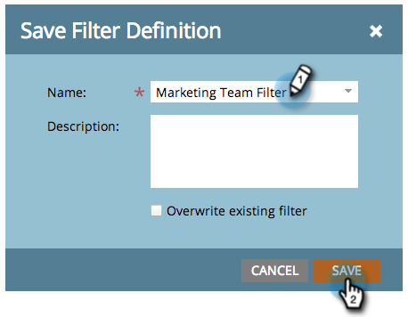

# Guardar una definición de filtro en el calendario de marketing {#saving-a-filter-definition-in-the-marketing-calendar}

Guardar un filtro permite cambiar de una definición a otra.

>[!PREREQUISITES]
>
>[Filtrado del calendario de marketing](/help/marketo/product-docs/core-marketo-concepts/marketing-calendar/working-with-the-calendar/filtering-the-marketing-calendar.md)

1. Defina el filtro.

   

1. Haga clic en el icono Guardar .

   

1. Asigne un nombre al filtro. Haga clic en **Guardar**.

   

   ¡Vamos! El filtro ahora se guarda.

   

   Si lo desea, puede [enviar una copia](/help/marketo/product-docs/core-marketo-concepts/marketing-calendar/working-with-the-calendar/sharing-a-filter-definition-in-the-marketing-calendar.md) de la definición a otros usuarios de Marketo.

   >[!NOTE]
   >
   >[Uso compartido de una definición de filtro en el calendario de marketing](/help/marketo/product-docs/core-marketo-concepts/marketing-calendar/working-with-the-calendar/sharing-a-filter-definition-in-the-marketing-calendar.md)
