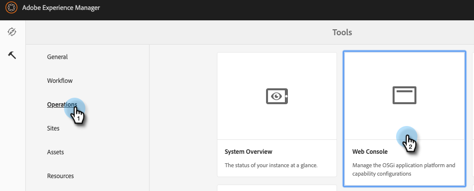

# Configuración de la integración de Adobe Experience Manager {#configuring-adobe-experience-manager-integration}

Configure AEM para que pueda acceder, seleccionar e importar AEM recursos en Marketo Design Studio.

>[!NOTE]
>
>**Se requieren permisos de administrador**

>[!IMPORTANT]
>
>* Esta integración solo funciona con implementaciones locales de AEM y no es compatible con implementaciones de AEM Cloud Service.
>
>* Actualmente, esta función solo es totalmente compatible con Firefox. No es compatible con Safari y es posible que no funcione en la última versión de Chrome, en función de la configuración de cookies de SameSite.

1. Vaya a Adobe Experience Manager (la dirección URL es específica de su empresa).

   

1. Puede iniciar sesión con Adobe o con inicio de sesión local. En este ejemplo iniciaremos sesión localmente.

   

1. En **Herramientas**, haga clic en **Operaciones** y seleccione **Consola web**.

   

1. En el navegador, busque &quot;Política de uso compartido de recursos de origen cruzado de Adobe Granite&quot; (ctrl+f en Windows, cmd+f en Mac).

   

1. Haga clic en el **+** a la derecha.

   

1. En el **Orígenes permitidos (Regexp)** cuadro de texto, escriba `https://.*\.marketo\.com` y haga clic en **Guardar**.

   

1. En el encabezado de la parte superior de la página, haga clic en **Consola web** y seleccione **Información del sistema**.

   

1. En Información del servidor, haga clic en la **Restart** botón.

   

1. Haga clic en **OK** para confirmar.

   

1. En Marketo Classic, haga clic en **Administrador**.

   

1. En Integración, seleccione **Adobe Experience Manager**.

   

1. Haga clic en **Editar**.

   

1. Introduzca la dirección URL de AEM y haga clic en **OK**.

   

   ¡Estás listo! Ahora puede [importar AEM recursos en Design Studio en Marketo Sky](https://experienceleague.adobe.com/docs/marketo/sky/design-studio/importing-assets-with-adobe-experience-manager.html?lang=en#design-studio).
