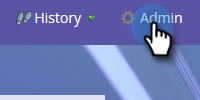
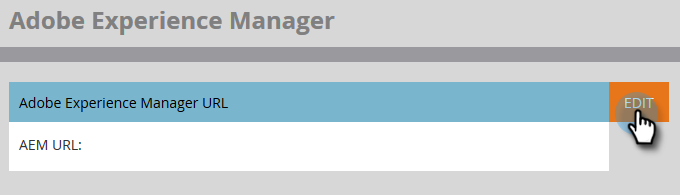

# Configuración de la integración de Adobe Experience Manager {#configuring-adobe-experience-manager-integration}

Configure Adobe Experience Manager (AEM) para poder acceder, seleccionar e importar recursos de AEM en Marketo Engage Design Studio.

>[!NOTE]
>
>**Se requieren permisos de administrador**

>[!IMPORTANT]
>
>* Esta integración solo funciona con implementaciones locales de AEM y no es compatible con implementaciones de AEM Cloud Service.
>
>* Actualmente, esta función solo es totalmente compatible con Firefox. Safari no lo admite y es posible que no funcione en la versión más reciente de Chrome, según la configuración de la cookie de SameSite.

1. Vaya a Adobe Experience Manager (la dirección URL es específica de su empresa).

   

1. Puede iniciar sesión con Adobe o localmente. Este ejemplo utiliza el inicio de sesión local.

   

1. En **[!UICONTROL Herramientas]**, haga clic en **[!UICONTROL Operaciones]** y seleccione **[!UICONTROL Consola web]**.

   

1. En su explorador, busque (ctrl+f en Windows, cmd+f en Mac) &quot;[!UICONTROL Política de uso compartido de recursos de origen cruzado de Adobe Granite]&quot;.

   

1. Haga clic en el signo **+** de la derecha.

   

1. En el cuadro de texto **[!UICONTROL Orígenes permitidos (Regexp)]**, escriba `https://.*\.marketo\.com` y haga clic en **[!UICONTROL Guardar]**.

   

1. En el encabezado de la parte superior de la página, haz clic en **[!UICONTROL Consola web]** y selecciona **[!UICONTROL Información del sistema]**.

   

1. En Información del servidor, haga clic en el botón **[!UICONTROL Reiniciar]**.

   

1. Haga clic en **[!UICONTROL Aceptar]** para confirmar.

   

1. En Marketo Engage, haga clic en **[!UICONTROL Administrador]**.

   

1. En Integración, seleccione **[!UICONTROL Adobe Experience Manager]**.

   

1. Haga clic en **[!UICONTROL Editar]**.

   

1. Escriba la dirección URL de AEM y haga clic en **[!UICONTROL Aceptar]**.

   
