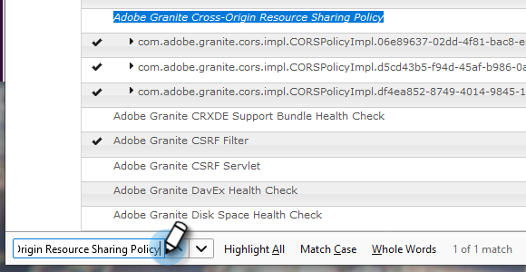

# Configuración de la integración de Adobe Experience Manager {#configuring-adobe-experience-manager-integration}

Configure AEM para que pueda acceder, seleccionar e importar AEM recursos en el estudio de diseño de Marketing Cloud.

>[!NOTE]
>
>**Se requieren permisos de administración**

>[!CAUTION]
>
>Actualmente, esta función solo es totalmente compatible con Firefox. No es compatible con Safari y es posible que no funcione en la versión más reciente de Chrome (v. 80), según la configuración de la cookie SameSite.

1. Vaya al Adobe Experience Manager (la dirección URL es específica de su compañía).

   

1. Puede iniciar sesión con Adobe o localmente. En este ejemplo iniciaremos sesión localmente.

   

1. En **Herramientas**, haga clic en **Operaciones** y seleccione **Consola Web**.

   

1. En el navegador, busque &quot;Política de uso compartido de recursos de Adobe Granite Cross-Origen&quot; (ctrl+f en Windows, cmd+f en Mac).

   

1. Haga clic en el signo **+** de la derecha.

   

1. En el cuadro de texto **Orígenes permitidos (Regexp)**, escriba `https://.*\.marketo\.com` y haga clic en **Guardar**.

   

1. En el encabezado de la parte superior de la página, haga clic en **Consola web** y seleccione **Información del sistema**.

   

1. En Información del servidor, haga clic en el botón **Reiniciar**.

   

1. Haga clic en **Aceptar** para confirmar.

   

1. En Marketing Classic, haga clic en **Administración**.

   

1. En Integración, seleccione **Adobe Experience Manager**.

   

1. Haga clic en **Editar**.

   

1. Introduzca la dirección URL de AEM y haga clic en **Aceptar**.

   

   ¡Estás listo! Ahora puede [importar recursos de AEM en Design Studio en Marketo Sky](https://help.marketo.com/hc/en-us/articles/360036765993).
