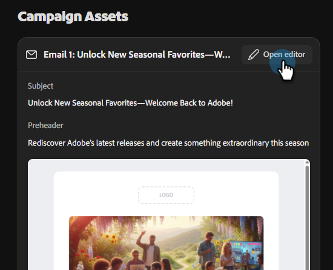

# Creación de una campaña de correo electrónico {#create-an-email-campaign}

Obtenga información sobre cómo generar y revisar campañas de correo electrónico completas en minutos.

>[!IMPORTANT]
>
>En este momento, solo puede generar campañas, pero aún no puede enviarlas (iniciarlas). La funcionalidad de Launch estará disponible próximamente.

## Antes de comenzar

Asegúrese de que dispone de:

* Una cuenta activa de Campañas de compañeros de trabajo de Adobe CX Enterprise ([regístrese aquí](https://coworker-essentials.experience.adobe.com/){target="_blank"} si aún no lo ha hecho).

* Tu marca se agregó en **Tus cosas** > **Marcas**.

* (Opcional, pero recomendada) Se ha cargado una plantilla de correo electrónico de HTML en **Sus cosas** > **Plantillas de correo electrónico**.

* Un CSV de audiencia listo para cargar.

* Una idea clara del objetivo de la campaña (por ejemplo, &quot;recuperar clientes caducados&quot; o &quot;invitar a usuarios de prueba a un seminario web&quot;).

## Paso 1: Iniciar un nuevo chat

Desde la página de inicio, tiene tres formas de empezar:

**Opción uno**: escriba un mensaje en la barra de mensajes central.

_Cuándo se debe usar: cuando se sabe exactamente lo que se desea._

**Opción dos**: elige una plantilla lista para usar de la sección **Plantillas de campaña** debajo de la barra de mensajes.

_Cuándo usar: cuando no está seguro de lo que desea._

**Opción tres**: usa una opción &quot;Ayúdame a preguntar&quot; en la lista desplegable de la barra de mensajes para que Campañas de trabajo te guíen a través de la escritura del mensaje.

_Cuándo usar: cuando tengas una idea de lo que deseas, pero quieras un poco de ayuda (o, usa &quot;Sorpréndeme&quot; para sorprenderte)._

{width="800" zoomable="yes"}

## Paso 2: Crear el mensaje

Un potente mensaje de Campañas de compañeros incluye lo siguiente:

* El objetivo de la campaña (lo que está intentando lograr).
* La audiencia (para quién es o de dónde provienen los datos de audiencia).
* Formato y estructura (número de correos electrónicos, cadencia, tono).
* Señales de marca o contexto (referencias a su marca, producto o campaña).

Por ejemplo:

`"Create a single-touch win-back email campaign for customers who bought last year but haven't returned. Use the CSV I am uploading. Make sure the content feels seasonal."`

>[!TIP]
>
>Para ver más ejemplos, consulte el artículo _Casos de uso_.

>[!NOTE]
>
>Si ya tiene un resumen de campaña, cárguelo junto con el mensaje como contexto adicional para el plan que generará para usted.

Cuando tenga la solicitud lista, haga clic en **Generar campaña**. Las campañas de compañeros de trabajo:

* Genere un plan de campaña estructurado.
* Pregunte por la audiencia de destino, que también se utilizará para la personalización de contenido.
* Borrador de contenido de correo electrónico personalizado para cada paso.
* Construye dinámicamente el recorrido a lo largo del camino.
* Montarlo todo en un solo tablero de campaña.

## Paso 3: Carga de la audiencia

Las audiencias se cargan mediante CSV. Todas las audiencias son específicas para sus respectivas campañas (no se almacenan en ningún otro lugar del entorno en este momento).

1. Después de enviar la solicitud, revise las tareas que ejecutará el colaborador y haga clic en **Generar**.

1. En el panel _Conversión de campaña_ de la izquierda, haga clic en **Cargar CSV**.

   

   >[!NOTE]
   >
   >* La dirección de correo electrónico es un campo obligatorio, el nombre, la fecha de última compra y cualquier otro campo que se pueda utilizar para la personalización son recomendados.

1. Importe el archivo CSV.

   >[!IMPORTANT]
   >
   >Excluya los contactos que no desee enviar por correo electrónico (usuarios sin suscribir, direcciones internas, cuentas de prueba) antes de cargarlos. Aunque habilitaremos progresivamente la funcionalidad para excluir usuarios específicos o añadir atributos durante el transcurso de la prueba, no está disponible inmediatamente a partir de la fecha de lanzamiento.

## Paso 4: Revisar y perfeccionar Campaign Assets

Para realizar cambios en el correo electrónico, desplácese hacia la derecha. En _Campaign Assets_, haga clic en **Abrir editor**.

Existen dos formas de actualizar el contenido.

* Realice manualmente los cambios deseados seleccionando varias secciones del correo electrónico (por ejemplo: reemplazar la línea de asunto, actualizar una imagen, etc.).

-o-

* Utilice la interfaz conversacional para realizar cambios hablando directamente con Campañas de compañeros de trabajo. Algunos ejemplos son:

   * &quot;Haga que la línea de asunto sea más urgente&quot;.
   * &quot;Acorta la copia del cuerpo&quot;.
   * &quot;Haga que call to action sea más fuerte&quot;.

También puede utilizar los botones de IA para refinar el Asunto o el Preencabezado.

## Paso 5: Enviar un correo electrónico de prueba

Antes de iniciar, envíese la campaña para que pueda revisarla en una bandeja de entrada real. Utilice esta opción para asegurarse de que el correo electrónico se procesa del modo deseado, de que los vínculos funcionan, de que cualquier personalización es precisa, etc.

>[!NOTE]
>
>En este momento, solo puede enviarse un correo electrónico de prueba, y solo uno a la vez.

## Paso 6: Pasos siguientes

La funcionalidad de Launch (envío de la campaña de correo electrónico) estará disponible próximamente. Hasta entonces, puede revisar el contenido con su equipo y comenzar con su próxima campaña.

## Preguntas frecuentes

**¿Por qué tarda tanto la primera respuesta?**

Genera una campaña completa, incluida la estrategia, la audiencia que necesita, el flujo de trabajo, etc. El tiempo promedio de la primera respuesta con el contenido generado suele ser de alrededor de un minuto.

**¿Qué puedo hacer si el resultado de Campañas de compañeros no es correcto?**

Haga clic en el icono de comentarios en el encabezado y háganoslo saber para que podamos mejorar la plataforma.

**¿Puedo editar correos electrónicos directamente o solo mediante chat?**

Puedes hacer ambas cosas.

**¿Cómo puedo guardar una campaña sin iniciarla?**

Todas las campañas se guardan automáticamente. Si necesitas acceso a conversaciones recientes, están disponibles en la ventana de la izquierda (debajo de **Chats** si no has creado tu campaña, debajo de **Campañas** si es que lo has hecho).

**¿Hay un límite en el tamaño de mi archivo para la carga de CSV?**

Sí, el límite de tamaño es de 8 MB.

**¿Qué sucede si el CSV de mi audiencia devuelve errores?**

Asegúrese de que el archivo CSV no contenga caracteres ocultos &quot;enriquecidos&quot;.

**¿Cómo se usan las plantillas de campaña?**

Seleccione la plantilla que desee y haga clic en **Remix**. A continuación, puede actualizar todos los tokens de personalización y hacer clic en el icono **enviar** en la parte inferior derecha.

**¿Cómo comparto un borrador de campaña con un compañero de equipo para que lo revise?**

No hay ningún botón &quot;Compartir&quot; en este momento. Sin embargo, puede descargar el contenido como HTML o exportarlo como un documento de PDF o Word.
