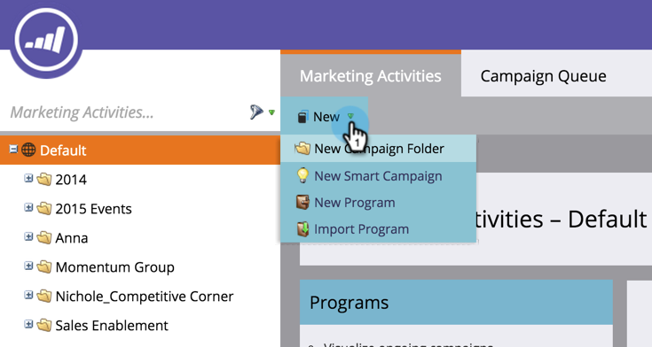
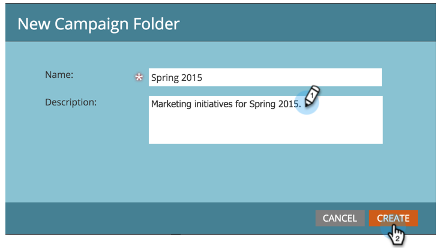

# Crear nueva carpeta de campaña {#create-new-campaign-folder}

Las carpetas de campañas le ayudan a mantener un espacio de trabajo ordenado. Siga estos sencillos pasos y irá camino a la magia de la automatización.

1. Vaya a Actividades **de marketing**.

   

1. Seleccione **Nuevo**.

   

1. Seleccione **Nueva carpeta** de campaña.

   

1. Introduzca un **nombre** para la carpeta de campaña.

   

1. Opcional: Introduzca una **Descripción** y haga clic en** Crear. **

   >[!TIP]
   >
   >Las descripciones son para otros usuarios de la suscripción. Sus clientes no verán este mensaje.

   

   ¡Increíble! Acaba de crear una carpeta de campaña. Míralo en el árbol.

   

   Ahora, al [crear un nuevo programa](../../../product-docs/core-marketo-concepts/programs/creating-programs/create-a-program.md), verá esta campaña como una opción.

>[!MORELIKETHIS]
>
>* [Crear un Programa](../../../product-docs/core-marketo-concepts/programs/creating-programs/create-a-program.md)
>* [Crear una nueva Campaña inteligente](../../../product-docs/core-marketo-concepts/smart-campaigns/creating-a-smart-campaign/create-a-new-smart-campaign.md)

>

