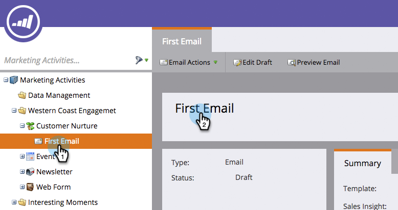

# Cambiar el nombre de un recurso de Marketo {#rename-a-marketo-asset}

Es posible cambiar fácilmente el nombre de las carpetas, los programas y los recursos locales.

1. Seleccione cualquier recurso cuyo nombre desee cambiar y haga clic en el bloque de nombre del panel derecho.

   

1. Escriba un nuevo nombre dentro del campo de texto. Haga clic en **Guardar**.

   

   >[!NOTE]
   >
   >No es posible cambiar el nombre de los archivos e imágenes que se han cargado ni de los recursos a los que se hace referencia actualmente en una lista inteligente o campaña inteligente (en filtros, déclencheur, pasos de flujo, etc.).
