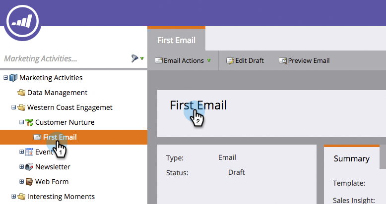

# Cambiar el nombre de un recurso de Marketo {#rename-a-marketo-asset}

Se puede cambiar el nombre de las carpetas, los programas y los recursos locales.

1. Seleccione cualquier recurso al que desee cambiar el nombre y haga clic en el bloque con el nombre del panel derecho.

   

1. Escriba un nombre nuevo en el campo de texto. Haga clic en **[!UICONTROL Guardar]**.

   

   >[!NOTE]
   >
   >No puede cambiar el nombre de los archivos e imágenes que se han cargado o de un recurso al que se hace referencia actualmente en una lista inteligente o en una campaña inteligente (en filtros, déclencheur, pasos de flujo, etc.).
