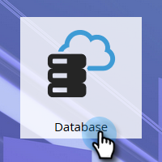
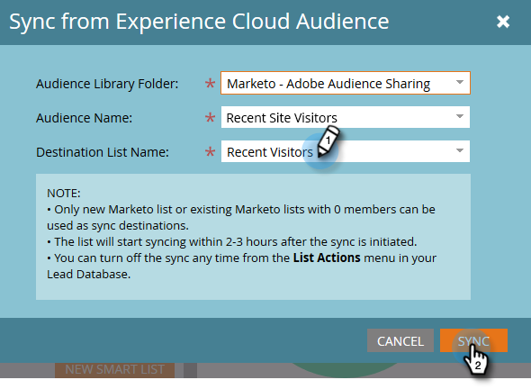

# Sincronizar una audiencia desde Adobe Experience Cloud {#sync-an-audience-from-adobe-experience-cloud}

>[!NOTE]
>
>Una implementación lista para HIPAA de una instancia de Marketo no puede utilizar esta integración.

>[!PREREQUISITES]
>
>[Configuración del uso compartido de audiencias de Adobe Experience Cloud](/help/marketo/product-docs/core-marketo-concepts/miscellaneous/set-up-adobe-experience-cloud-audience-sharing.md)

## Sincronización de una audiencia {#how-to-sync-an-audience}

1. En My Marketo, haga clic en el mosaico **Database**.

   

1. Haga clic en la lista desplegable **New** y seleccione **Sincronizar desde Audiencia de Experience Cloud**.

   

1. Haga clic en la lista desplegable **Audience Library Folder** y seleccione la carpeta de origen que desee.

   

1. Seleccione un **Nombre de audiencia**.

   

1. Para el destino, puede seleccionar una lista existente o escribir el nombre de una nueva. En este ejemplo estamos creando uno nuevo. Haga clic en **Sincronizar** cuando termine.

   

1. Haga clic en **OK**.

   

## Preguntas frecuentes {#faq}

**¿Cómo funciona la sincronización de cookies?**

Cuando la sincronización de cookies esté habilitada para su suscripción de Marketo, munchkin.js de Marketo intentará capturar y almacenar los ECID de Adobe para la organización de Adobe IMS que especificó durante la configuración de la integración y hacer coincidir estos ECID con el identificador de cookie de Marketo correspondiente. Esto permite que los perfiles de usuario anónimos de Marketo se enriquezcan con los ECID de Adobe.

Se requiere un paso más para asociar el perfil de usuario anónimo a un perfil de posible cliente, que se identifica mediante un correo electrónico de texto sin formato. Exactamente cómo funciona [se describe aquí](/help/marketo/product-docs/reporting/basic-reporting/report-activity/tracking-anonymous-activity-and-people.md).

**¿Por qué el tamaño de la lista en Marketo es diferente del de Adobe?**

Una persona tampoco se sincronizará si no podemos vincular un ID de cookie de ECID a una persona conocida en Marketo.

**¿Se trata de una sincronización única?**

Solo es necesario iniciar la sincronización una vez. Después, los registros se sincronizarán automáticamente. La sincronización inicial puede tardar hasta 24 horas; en adelante, los registros nuevos se sincronizarán en 2-3 horas.
