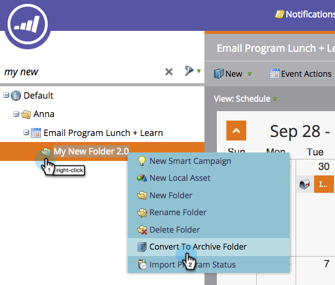

# Explicación de las carpetas {#understanding-folders}

Las carpetas dentro de un programa se pueden usar para organizar las campañas inteligentes y los recursos. Son diferentes de [carpetas de campaña](/help/marketo/product-docs/core-marketo-concepts/miscellaneous/create-new-campaign-folder.md).

## Crear una carpeta {#create-a-folder}

1. Vaya al área **Marketing Activities** .

   

1. Haga clic con el botón derecho en un programa y seleccione **New Folder**.

   

1. Asigne un nombre a la nueva carpeta y pulse **Enter**.

   

¡bueno! Ahora tiene una nueva carpeta para almacenar los recursos locales.

## Cambiar el nombre de una carpeta {#rename-a-folder}

Está bien cambiar de opinión.

1. Haga clic con el botón derecho en la carpeta y seleccione **Cambiar nombre de carpeta**.

   

1. Escriba un nombre nuevo y pulse **Entrar**.

   

   ¡Et Volia! La carpeta tiene un nombre nuevo.

## Eliminar una carpeta {#delete-a-folder}

>[!NOTE]
>
>Asegúrese de que la carpeta esté vacía antes de eliminarla.

1. Haga clic con el botón derecho en la carpeta y seleccione **Delete Folder**.

   

   ¡Adios folder!

## Archivar una carpeta {#archive-a-folder}

En Marketo, puede convertir las carpetas existentes en Carpetas de archivo . Las carpetas de archivo existen en Marketing Activities, Database y Design Studio.

Al archivar una carpeta:

* La carpeta y los recursos ya no están visibles en los resultados de búsqueda. Si busca un programa o evento que se encuentre dentro de una carpeta archivada, los resultados devuelven una vista contraída de la carpeta archivada
* Los recursos de la carpeta ya no aparecen en la sugerencia automática
* Las plantillas archivadas no están disponibles al crear un correo electrónico o una página de aterrizaje en Design Studio.
* Las páginas archivadas no se pueden usar en grupos de prueba de página de aterrizaje

Funcionalidad que **no** cambiará al archivar:

* La búsqueda global todavía encuentra resultados en carpetas archivadas
* Un recurso que está en uso seguirá funcionando incluso después de archivarlo
* Puede utilizar un filtro para seleccionar recursos archivados y utilizarlos en informes
* Los recursos archivados no están desactivados. También deben desactivarse si desea que dejen de ejecutarse
