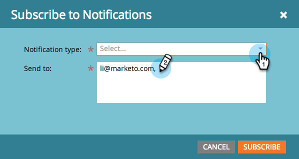

# Explicación de las notificaciones {#understanding-notifications}

Las notificaciones le mantienen al día de los eventos del sistema que se producen en su suscripción de Marketing. Por ejemplo, las notificaciones de error de Campaña le informan de los errores de sus campañas inteligentes y las notificaciones de sincronización de CRM le alertan de los problemas críticos que se han encontrado con la sincronización de CRM, como los permisos incorrectos o la sincronización que se está desactivando.

## Información general {#overview}

1. Las nuevas notificaciones aparecen en la parte superior derecha de Marketing.

   

1. Haga clic en Notificaciones para vista de todas las notificaciones.

   

## Suscripción a Notificaciones {#subscribe-to-notifications}

Puede suscribirse a las notificaciones para recibirlas en su correo electrónico.

1. Vaya a Notificaciones y haga clic en Suscribirse.

1. Seleccione el tipo de notificación e introduzca las direcciones de correo electrónico a las que desea enviar las notificaciones.

>[!NOTE]
>
>En algunos casos, una notificación proporciona un vínculo &quot;Ver la lista completa&quot; para descargar un archivo de valores separados por comas (CSV), por ejemplo, el archivo de errores de sincronización de Microsoft Dynamics. Marketo conserva estos archivos CSV durante 30 días. Si intenta descargar el archivo después de 30 días, obtendrá un error 404.

>[!TIP]
>
>¿Desea cancelar la suscripción de los correos electrónicos de notificación? No hay problema. Simplemente haga clic en el vínculo **Cancelar suscripción a Notificaciones** en la parte inferior del correo electrónico.

