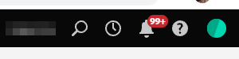

# Explicación de las notificaciones {#understanding-notifications}

Las notificaciones le mantienen informado sobre los eventos del sistema que se producen en su suscripción a Marketo Engage. Por ejemplo, las notificaciones de errores de Campaign le informan sobre los errores de sus campañas inteligentes y las notificaciones de sincronización CRM le avisan sobre los problemas críticos que se encuentran con la sincronización CRM (como permisos incorrectos o la sincronización desactivada).

## Información general {#overview}

1. Las nuevas notificaciones aparecen en la parte superior izquierda de Marketo Engage.

   

1. Haga clic en el icono _Notificaciones_ para ver todas las notificaciones.

   {width="800" zoomable="yes"}

## Suscribirse a notificaciones {#subscribe-to-notifications}

Puede suscribirse a las notificaciones para recibirlas en su correo electrónico.

1. En la pantalla _Notificaciones_, haga clic en **[!UICONTROL Suscribirse]**.

   

1. Seleccione _Notification type_ y _Workspace_. Introduzca la dirección de correo electrónico a la que desea enviar las notificaciones (puede añadir más de una, separadas por una coma). Haga clic en **[!UICONTROL Suscribirse]** cuando haya terminado.

   

>[!NOTE]
>
>El cuadro **[!UICONTROL Enviar a]** solo sirve para que usted ingrese una dirección de correo electrónico; no mostrará una lista de suscriptores existentes.

En algunos casos, una notificación proporciona el vínculo &quot;Ver la lista completa&quot; para descargar un archivo de valores separados por comas (CSV), por ejemplo, el archivo de errores de sincronización de Microsoft Dynamics. Marketo Engage conserva estos archivos CSV durante 30 días. Si intenta descargar el archivo después de 30 días, se producirá un error 404.

>[!TIP]
>
>¿Quiere cancelar la suscripción a los correos electrónicos de notificación? No hay problema. Simplemente haga clic en el vínculo **[!UICONTROL cancelar la suscripción a las notificaciones]** en la parte inferior del mensaje de correo electrónico de notificación.
