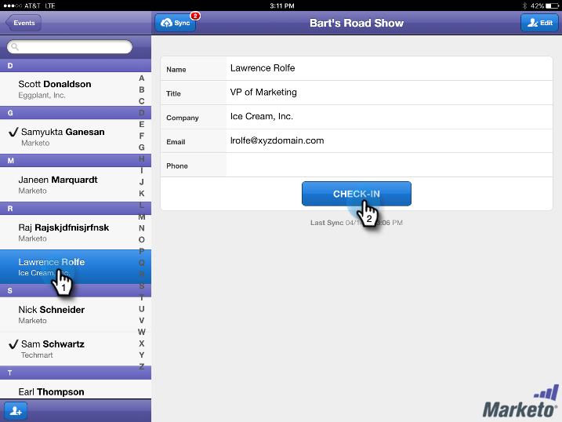
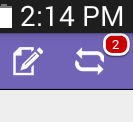
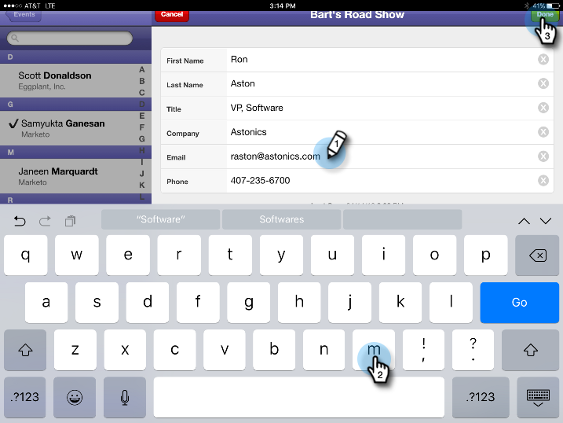

# Comprobar personas en el evento desde su tableta {#check-people-into-your-event-from-your-tablet}

Cuando las personas asistan a su evento, puede encontrar su información en la aplicación. Después del registro, se promocionan al estado Asistido cuando se sincroniza con Marketo.

La aplicación funciona igual en iPad y Android, excepto por diferencias menores de diseño y diseño.

>[!PREREQUISITES]
>
>* Cree un evento en Marketo y rellénelo con Invitados y Registrados .
>* Descargue la aplicación para tableta para [Android](https://play.google.com/store/apps/details?id=com.marketo.eventcheckin&amp;hl=en) o [iOS](https://itunes.apple.com/us/app/marketo-events/id522766637?mt=8)

## Comprobar invitados registrados {#check-in-registered-guests}

1. Pulse el icono de la aplicación en su iPad o tableta de Android.

1. Toque **Iniciar sesión** para iniciar la aplicación de eventos de Marketo.

   

1. Introduzca su nombre de usuario y contraseña de Marketo y haga clic en **Login**.

   >[!NOTE]
   >
   >Debe tener una función con acceso a la base de datos para ver a las personas en la aplicación.

1. Seleccione un **Event**.

   

   >[!TIP]
   >
   >Solo se muestran los programas de eventos (excepto los seminarios web) programados una semana antes y una semana después de la fecha de hoy.

1. En la pantalla de inicio, busque Visitantes registrados . Para encontrar una persona en la lista, puede:

   * Desplácese para encontrar un nombre
   * Escriba un nombre en el campo de búsqueda
   * Salte a una letra inicial específica del apellido al tocarla en el lado derecho de la lista

   >[!NOTE]
   >
   >El proceso es el mismo en iPad y Android, pero las pantallas son diferentes y los elementos pueden estar en diferentes ubicaciones. Este artículo incluye la interfaz de iPad. Compare la pantalla de Android de esta sección para obtener referencia.

   **iPad**

   

   **Android**

   

1. Pulse el nombre seleccionado y, en el registro de persona, pulse **Check-in**.

   

El invitado ahora tiene un estado Asistido y recibe una marca de verificación. El registro de persona se actualiza al sincronizar con Marketo. El contador rojo del botón Sincronizar aumenta para mostrar el número de registros desde la última sincronización con Marketo. El botón Sincronizar tiene un aspecto diferente y se encuentra en una ubicación diferente para iPad y Android:

**iPad**

**Android**

>[!TIP]
>
>Si una persona está invitada pero no se ha registrado, puede buscar el nombre haciendo clic en **Buscar en el servidor**, justo debajo del cuadro Buscar. El estado Invitado cambia a **Asistido** para el evento.

## Crear una nueva persona en el tablero {#create-a-new-person-on-the-tablet}

Puede agregar manualmente invitados que no sean personas existentes en la base de datos de Marketo. Se registrarán automáticamente y se agregarán a la base de datos cuando sincronice con Marketo.

1. Haga clic en **Add**.

   **iPad**

   

   **Android**

   

1. Complete tantos campos de información básicos como pueda y pulse **Listo**.

   

   >[!NOTE]
   >
   >Solo puede utilizar los campos existentes. No puede crear las personalizadas.

   >[!CAUTION]
   >
   >Compruebe la dirección de correo electrónico. Otros campos se pueden corregir más adelante, pero la dirección de correo electrónico es el método principal para ponerse en contacto con el invitado.

La nueva persona está registrada como protegida en su evento y se agregará a la base de datos de Marketo con estado de asistencia cuando sincronice con Marketo.

## Invertir un registro {#reverse-a-check-in}

Si archiva una persona por error, _antes de sincronizarla con Marketo_, puede invertir el estado Asistido.

1. Pulse el nombre en la lista y, en el registro de persona, pulse **Deshacer**.

   

   ¡Todo arreglado!

## Editar un registro de persona en el registro {#edit-a-person-record-at-check-in}

Puede añadir y modificar la información del invitado, justo en el evento!

1. Pulse el nombre en la lista de personas y pulse **Editar**.

   

1. Edite y agregue información a los campos y, a continuación, pulse **Listo**.

   

   >[!NOTE]
   >
   >En Android, el botón **Listo** puede estar oculto. Desplácese hacia abajo para encontrarlo.

La información se actualizará cuando sincronice la aplicación con Marketo.

## Sincronizar la aplicación con Marketo {#sync-the-app-with-marketo}

La aplicación Eventos de Marketo funciona de forma independiente hasta que se vuelve a sincronizar la actividad con la base de datos de Marketo. Es mejor sincronizar lo antes posible después del último registro de entrada. La tableta debe estar conectada a Internet.

>[!CAUTION]
>
>Después de la sincronización, no se puede revertir un registro desde la aplicación.

1. En la tableta, abra la aplicación y vaya hasta el evento.

1. Toque **Sincronizar**.

   El evento se actualiza con nuevos registros en la base de datos de Marketo. El contador rojo del botón Sincronizar se borra hasta que se marca a otra persona.

   Por motivos de seguridad, debe salir de la aplicación Eventos de Marketo una vez que haya terminado de sincronizar.

## Trabajo con acceso a Internet limitado {#working-with-limited-internet-access}

Algunos lugares tienen un acceso a Internet muy limitado. Necesita una buena conexión para:

* Descargar e instalar la aplicación
* Iniciar sesión
* Seleccionar un evento
* Sincronizar la aplicación con Marketo

Si le preocupa el acceso a Internet en el lugar, es posible que desee iniciar sesión en la aplicación Marketo Events y seleccionar el evento con antelación, en un lugar con acceso a Internet seguro. De este modo, aún puede utilizar la aplicación sin conexión. A continuación, cuando recupere una conexión a Internet, sincronice inmediatamente con la base de datos de Marketo.

>[!TIP]
>
>Si no tiene una conexión a Internet, puede crear una nueva persona para que se registre. Se reconciliará con la persona existente al sincronizar la aplicación.

>[!NOTE]
>
>La aplicación cierra la sesión automáticamente tras ocho horas de inactividad.
