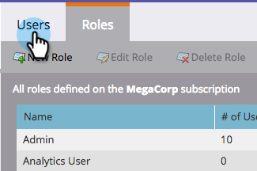

# Conceder acceso a los usuarios a la aplicación de registro {#grant-users-access-to-the-check-in-app}

Marketing tiene una función de usuario especial para la aplicación de registro de evento. A continuación se explica cómo crear una nueva función con permiso para usar la aplicación.

## Crear una nueva función de usuario para dispositivos móviles {#create-a-new-user-role-for-mobile}

1. Haga clic en **Administración**.

   

1. Haga clic en **Usuarios y funciones**.

   

1. Haga clic en la ficha **Funciones** y, a continuación, haga clic en **Nueva función**.

   

1. Escriba un nombre para la nueva función y una descripción opcional. Marque la casilla **Acceder a la aplicación móvil** y haga clic en **Crear**.

   

   La nueva función está lista para asignarse cuando se invita a personas a utilizar la aplicación para tablets.

## Invitar a nuevos usuarios a la aplicación de registro {#invite-new-users-for-the-check-in-app}

1. Haga clic en la ficha **Usuarios**.

   

1. Haga clic en **Invitar a nuevo usuario**.

   

1. Introduzca la información del nuevo usuario. Seleccione las casillas de verificación de todas las funciones apropiadas y la nueva función con el permiso para acceder a la aplicación móvil. Haga clic en **Invitar** cuando haya terminado.

   

   >[!CAUTION]
   >
   >Los usuarios que no tienen acceso a la base de datos no pueden ver a ninguna persona en la aplicación.

   >[!TIP]
   >
   >Para los usuarios existentes, puede crear una nueva función o agregar el permiso de aplicación móvil de Access a la función actual.

El usuario recibirá un mensaje de correo electrónico que le indicará que tiene acceso a la aplicación de registro.
