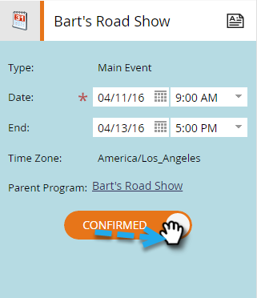
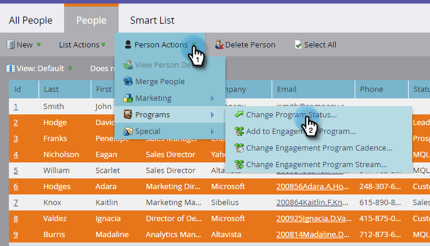

# Preparación para el evento {#prepare-for-your-event}

Hay varias cosas que debe hacer para prepararse para el evento.

## Crear una nueva función de Marketo {#create-a-new-marketo-role}

Marketo tiene una función de usuario especial para la aplicación de registro de evento. [Crear una nueva función de Marketo](/help/marketo/product-docs/core-marketo-concepts/mobile-apps/event-check-in/grant-users-access-to-the-check-in-app.md) para usuarios de iPad o Android, con permiso para acceder a la aplicación móvil.

## Invitar a nuevos usuarios de tableta al evento {#invite-new-tablet-users-to-the-event}

[Invitar a nuevos usuarios de tableta al evento](/help/marketo/product-docs/core-marketo-concepts/mobile-apps/event-check-in/grant-users-access-to-the-check-in-app.md) y asígneles la nueva función.

## Crear un nuevo programa de eventos de Marketo {#create-a-new-marketo-event-program}

[Crear un nuevo programa de eventos de Marketo](/help/marketo/product-docs/demand-generation/events/understanding-events/create-a-new-event-program.md) para capturar el estado de sus personas a medida que avanzan por diferentes etapas y obtener mediciones precisas del ROI para sus iniciativas de marketing.

## Especificar las fechas del evento {#specify-the-event-dates}

Es un ajuste para establecer las fechas del evento.

1. Haga clic en el evento de la programación y configure la fecha y hora de inicio y finalización.

   

1. Desplácese hacia arriba para cambiar **Tentativo** a **Confirmado**.

   

   >[!CAUTION]
   >
   >Si la fecha del evento es superior a una semana antes o después de la fecha actual, el evento no aparecerá en la aplicación. **Sugerencia**: Para probarlo, establezca temporalmente las fechas en en la semana de hoy. Recuerde devolver el evento a las fechas correctas después de probarlo.

## Añadir personas al evento {#add-people-to-your-event}

Ahora que conoce el *when*, es hora de agregar la variable *who*.

1. Si ya tiene una lista de personas, en Mi Marketo, haga clic en el botón **Base de datos** mosaico.

   

1. Seleccione una lista con personas y haga clic en el botón **People** pestaña .

   

1. Seleccione las personas para el evento en la lista. Uso **Ctrl** (o **Comando** en un Mac) para hacer clic en varias personas, o **Seleccionar todo** para marcarlos todos.

   

1. Haga clic en **Acciones de persona**, pase el ratón sobre **Programas** y seleccione **Cambiar estado del programa**.

   

1. Haga clic en el **Programa** y seleccione el evento.

   

1. Haga clic en el **Nuevo estado** y seleccione **Programa > Registrado**. Haga clic en **Ejecutar ahora**.

   

1. Una ventana pequeña muestra el progreso...

   

1. ...e indica cuándo se ha completado la tarea.

   

   Las personas seleccionadas ya están en su evento, listas para ser registradas mediante la aplicación para tableta en el piso de la feria comercial.
