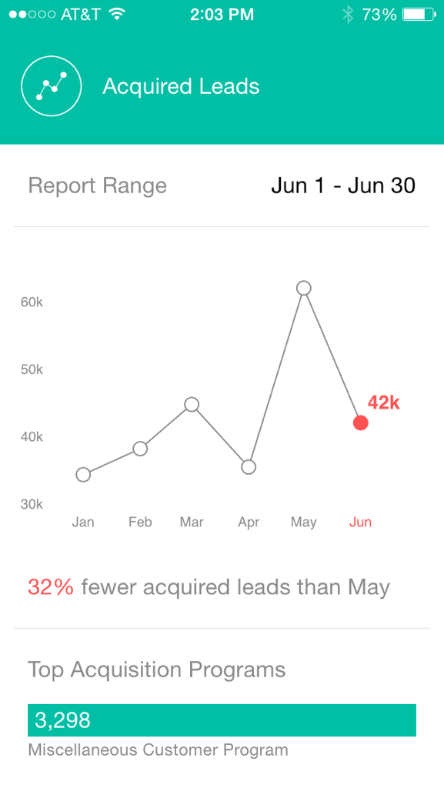

# Explicación de las tarjetas de Analytics {#understanding-analytics-cards}

Al principio de cada mes, Momentos de marketing proporciona tres tarjetas de informes diferentes: Posibles clientes adquiridos, Nuevos clientes potenciales y Cancelaciones de suscripciones. Cada uno muestra el rendimiento mensual y la tendencia a lo largo de un período de seis meses.

## Tarjetas de Analytics {#analytics-cards}

`<iframe width="420" height="315" src="https://www.youtube-nocookie.com/embed/OA5yfBkaNck" frameborder="0" allowfullscreen></iframe>` Al tocar una tarjeta de Analytics, puede:

* [Hacerlo favorito](../../../../../product-docs/core-marketo-concepts/mobile-apps/marketo-moments/working-with-moments/creating-a-favorite.md)
* [Marque como hecho](../../../../../product-docs/core-marketo-concepts/mobile-apps/marketo-moments/working-with-moments/marking-it-done.md)
* [Compartir](../../../../../product-docs/core-marketo-concepts/mobile-apps/marketo-moments/working-with-moments/sharing-a-moment.md)

Toque una tarjeta de Analytics para mostrar:

* Un gráfico de los resultados de los últimos seis meses
* Comparación mes tras mes
* Un gráfico de barras de los tres primeros (según la tarjeta)

Por ejemplo, veamos los detalles de la tarjeta Análisis de posibles clientes adquiridos:

En este ejemplo, rojo indica que el valor ha disminuido en el intervalo de fechas seleccionado (uh, oh!). El verde indica que el valor ha aumentado (¡ay!).

## Posibles clientes adquiridos {#acquired-leads}

La tarjeta **Posibles clientes adquiridos **le muestra un informe de tendencias mes tras mes sobre el número de nuevos posibles clientes.

>[!NOTE]
>
>Solo se ven los leads con un programa de adquisición definido.

## Nuevos leads {#new-leads}

La tarjeta **Nuevos posibles clientes** muestra un informe de tendencias mes tras mes sobre la cantidad total de nuevos posibles clientes en su instancia durante los últimos seis meses.

## Cancelar suscripciones {#unsubscribes}

La tarjeta **Cancelar suscripciones** muestra un informe de tendencias mes tras mes de la tasa de cancelación de suscripciones en los últimos seis meses.

Ahora ya sabes.

>[!NOTE]
>
>**Artículos relacionados**
>
>* [Explicación de los momentos del marketing](understanding-marketo-moments.md)
>* [Explicación de las tarjetas de Evento](understanding-event-cards.md)
>* [Explicación de las tarjetas de Programa de correo electrónico](understanding-email-program-cards.md)

>

Hecho divertido: El primer correo electrónico enviado fue por Ray Tomlinson en 1971.