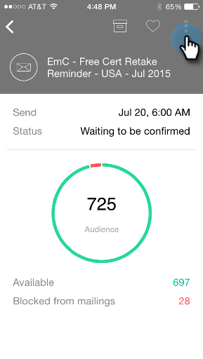

# Explicación de las tarjetas de Programa de correo electrónico {#understanding-email-program-cards}

Utilice Momentos de marketing para vista de sus Programas de correo electrónico desde su teléfono o iPad.

## Tarjetas de Programa de correo electrónico {#email-program-cards}

Al tocar cualquier tarjeta de Programa de correo electrónico, puede:

* [Convertir un correo electrónico en favorito](/help/marketo/product-docs/core-marketo-concepts/mobile-apps/marketo-moments/working-with-moments/creating-a-favorite.md)
* [Marcar un correo electrónico como hecho](/help/marketo/product-docs/core-marketo-concepts/mobile-apps/marketo-moments/working-with-moments/marking-it-done.md)
* [Compartir una tarjeta de hora de correo electrónico](/help/marketo/product-docs/core-marketo-concepts/mobile-apps/marketo-moments/working-with-moments/sharing-a-moment.md)

En una tarjeta de programa de correo electrónico para un correo electrónico que aún no se ha enviado, encontrará información sobre el estado y la audiencia de ese programa de correo electrónico.

Después de enviar el correo electrónico, la tarjeta muestra otra información valiosa, incluido el número de correos electrónicos enviados, las acciones de los destinatarios y un vínculo a la lista inteligente utilizada en la campaña.

## Confirmación de una tarjeta de correo electrónico {#confirming-an-email-card}

1. Para confirmar una tarjeta de correo electrónico no confirmada, toque el menú de tres puntos.

   

1. Toque **Confirmar**.

   

1. Toque **Confirmar** para finalizar el trabajo, o **No importa** si tuvo dudas.

   

   >[!NOTE]
   >
   >¡Ahora tu carta se volverá a naranja!

## Cancelación de un envío de tarjeta de correo electrónico {#canceling-an-email-card-send}

1. Si decide no enviar su correo electrónico confirmado, toque el menú de tres puntos.

   

1. Toque **Cancelar envío**.

   

## Reprogramación de una tarjeta de correo electrónico {#rescheduling-an-email-card}

Puede volver a programar las tarjetas de correo electrónico confirmadas o no confirmadas.

>[!NOTE]
>
>Para los correos electrónicos que ya están confirmados, primero debe cancelar el correo electrónico (ver abajo).

1. Para volver a programar un correo electrónico, toque el menú de tres puntos.

   

1. Toque **Reprogramar**.

   

1. Seleccione una fecha en el calendario y toque **Reprogramar**.

   

   Siempre que tengas un servicio inalámbrico, puedes reprogramar desde cualquier lugar.

## Envío de una muestra {#sending-a-sample}

Puede compartir una muestra de un momento de correo electrónico directamente con alguien.

1. Abra el menú de la tarjeta.

   

1. Toque **Enviar muestra**.

   

1. Introduzca una dirección de correo electrónico y haga clic en **Enviar muestra**.

   

## Vista preliminar de un mensaje de correo electrónico {#previewing-an-email}

Haga clic con el botón derecho en una tarjeta de correo electrónico para previsualización.

1. Toque **Correo electrónico de Previsualización**.

   

   De esta manera, usted sabe que su correo electrónico es perfecto antes de sacar el déclencheur!

   

   ¡Excelente!

Y esa es la primicia de ver tus campañas de correo electrónico. ¡Ahora eres un profesional!

>[!MORELIKETHIS]
>
>* [Explicación de los momentos del marketing](/help/marketo/product-docs/core-marketo-concepts/mobile-apps/marketo-moments/understanding-moments/understanding-marketo-moments.md)
>* [Explicación de las tarjetas de Evento](/help/marketo/product-docs/core-marketo-concepts/mobile-apps/marketo-moments/understanding-moments/understanding-event-cards.md)
>* [Explicación de las tarjetas de Analytics](/help/marketo/product-docs/core-marketo-concepts/mobile-apps/marketo-moments/understanding-moments/understanding-analytics-cards.md)

