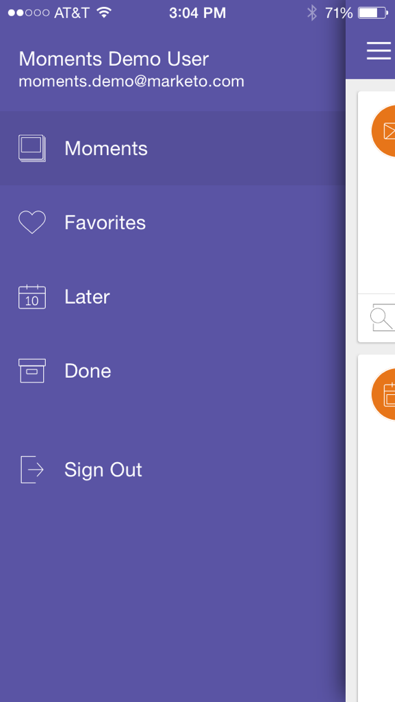

# Explicación de los momentos de Marketo {#understanding-marketo-moments}

¡El poder de Marketo está ahora en tus manos, literalmente! Previsualice y vuelva a programar correos electrónicos directamente desde su teléfono o iPad.

>[!AVAILABILITY]
>
>
>Se requiere el permiso de acceso a aplicaciones móviles. Póngase en contacto con el administrador de Marketo para [actualizar su función](/help/marketo/product-docs/administration/users-and-roles/managing-user-roles-and-permissions.md).

## Secuencias {#streams}

Aquí están los diferentes flujos en Moments.

>[!NOTE]
>
>**Definición**
>
>* Momentos: Todo lo que acaba de correr o está a punto de correr va aquí.
>* Favoritos: Cualquier cosa que hagas como favorita va aquí.
>* Más tarde: Cualquier cosa que ocurra después de este momento entra aquí.
>* Listo: Todo lo que haya terminado de correr o marcado como hecho va aquí.

Bien, ahora que lo hemos sacado del camino, echemos un vistazo a Marketo Moments por teléfono.

## Tres clases de tarjetas {#three-kinds-of-cards}

Marketo Moments le ofrece tres tarjetas diferentes para seguir el progreso de su correo electrónico:

**En cubierta** - Este correo electrónico está a punto de salir. Es la última oportunidad de obtener una vista previa, enviar una muestra o, incluso, cancelarla si es necesario.

**Heartbeat** - Oye, este correo electrónico está siendo entregado ahora! Y aquí también hay estadísticas. Adelante y compártalo.

**Resultados** - Así fue el correo electrónico. Una vez que el correo electrónico termina de ejecutarse, la tarjeta Resultados muestra la puntuación de participación y otras estadísticas.

## Flujo de momentos {#moments-stream}

La primera vez que abre la aplicación o toca **Momentos** en el menú, primero se muestran las tarjetas relevantes. Cada una contiene información sobre esa iniciativa de marketing específica y su rendimiento general.

Al tocar la tarjeta, se abre una pantalla de detalles.

>[!NOTE]
>
>Se confirman las tarjetas naranja; los grises son tentativos.

Al pulsar los tres puntos, se abre un menú de acción de tarjeta.

¡Excelente! Ahora, puede hacer que algo suceda tocando:

>[!NOTE]
>
>**Definición**
>
>* Favorito: Es fácil prestar atención a las cosas que son más oportunas e importantes si las haces favoritas.
>* Listo: Listo lo elimina de la vista Momentos de Marketo (pero lo deja en Marketo, seguro y con sonido).
>* Compartir: Envíe una imagen para motivar o felicitar a su equipo.
>* Enviar ejemplo (solo correo electrónico): Utilice esto para que otros puedan comprobar el aspecto de sus correos electrónicos antes de enviarlos.
>* Vista previa del correo electrónico (solo correos electrónicos): Siempre es buena idea consultar tus correos electrónicos con antelación.

## Momentos posteriores {#later-moments}

La sección Más adelante muestra las actividades siguientes.

1. Empiece tocando el menú hamburguesa.

   

1. Toque **Más tarde**.

   

   Consulte una lista de actividades futuras.

   

## Tarjetas de programa de correo electrónico {#email-program-cards}

Las tarjetas de programa de correo electrónico muestran cosas importantes como programación, audiencia, estado y otras cosas útiles, incluso cuando estás fuera a almorzar.

## Tarjetas de eventos {#event-cards}

Para los eventos, verá el número total de miembros y su estado.

## Tarjetas de Analytics {#analytics-cards}

Las tarjetas Moment de Analytics muestran el rendimiento de sus correos electrónicos y eventos mes a mes durante los últimos seis meses, para:

1. Posibles clientes adquiridos
1. Nuevos posibles clientes
1. Cancela suscripción

## Tarjetas de ejecución de campañas inteligentes {#smart-campaign-run-cards}

Las tarjetas de campaña inteligentes representan una sola ejecución de una campaña. Aparece una tarjeta nueva cada vez que se ejecuta la campaña inteligente. Pulse para ver los filtros de lista inteligente utilizados, el flujo de campaña y cada uno de los correos electrónicos utilizados en la campaña.

## Confirmar o cancelar una acción {#confirm-or-cancel-an-action}

En cada paso del camino, puede confirmar o cancelar una acción. Si cambia de opinión, pulse **No importa**.

## Versiones admitidas  {#supported-versions}

Marketo Moments admite estas versiones del sistema operativo:

* Apple iOS 8.0 y superior.
* Android versión 4.1 y superior (básicamente Jellybean y superior).

¿Listo para obtener más información?

>[!MORELIKETHIS]
>
>* [Información sobre las tarjetas de programa de correo electrónico](/help/marketo/product-docs/core-marketo-concepts/mobile-apps/marketo-moments/understanding-moments/understanding-email-program-cards.md)
>* [Información sobre las tarjetas de eventos](/help/marketo/product-docs/core-marketo-concepts/mobile-apps/marketo-moments/understanding-moments/understanding-event-cards.md)
>* [Información sobre las tarjetas de Analytics](/help/marketo/product-docs/core-marketo-concepts/mobile-apps/marketo-moments/understanding-moments/understanding-analytics-cards.md)
>* [Información sobre las tarjetas de campaña inteligentes](/help/marketo/product-docs/core-marketo-concepts/mobile-apps/marketo-moments/understanding-moments/understanding-smart-campaign-cards.md)

