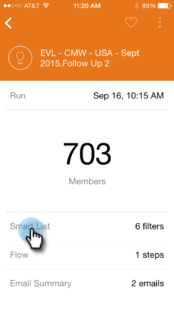
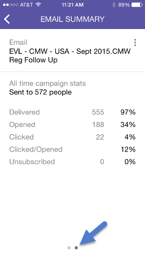

# Información sobre las tarjetas de campaña inteligentes {#understanding-smart-campaign-cards}

Utilice Marketo Moments para ver cada ejecución de sus campañas inteligentes desde su smartphone o iPad. La tarjeta de campaña inteligente Marketo Moments representa una sola ejecución de una campaña; aparece una tarjeta nueva cada vez que se ejecuta la campaña inteligente. Las tarjetas de campaña inteligentes están marcadas con una bombilla en la parte superior izquierda.

En futuras campañas inteligentes que estén programadas pero que aún no se hayan ejecutado, la tarjeta Momentos de Marketo aún no muestra ninguna estadística de campaña. Aparecerán en una versión futura.

## Tarjetas de campaña inteligentes {#smart-campaign-cards}

1. Pulse la tarjeta para abrir la tarjeta de detalles.

   

1. La tarjeta de detalles le permite acceder a información sobre los filtros de lista inteligente, Flujo y Resumen de correo electrónico.

1. Toque **Lista inteligente**.

   

1. Los filtros utilizados por la lista inteligente se muestran aquí.

   

1. Pulse **Flujo**.

   

1. Ahora, verá el flujo de la campaña inteligente. Esta campaña solo tiene un paso de flujo, pero puede haber varios.

   

1. Haga clic en **Resumen de correo electrónico**.

   

1. Ahora, puede ver la respuesta del destinatario a cada correo electrónico, por número y porcentaje.

   

1. ¿Ves esos dos puntos en la parte inferior? Indican que hay dos correos electrónicos conectados a esta campaña inteligente. Para ver los resultados del otro correo electrónico, deslice la pantalla hacia la izquierda. Estos son los resultados del segundo correo electrónico.

   

   >[!NOTE]
   >
   >Observe que el otro punto está resaltado ahora.

## Creación de muestras de correo electrónico y vistas previas {#creating-email-samples-and-previews}

Es una buena idea echar un vistazo a un correo electrónico antes de que salga. O bien, envíe una muestra a otra persona para que la vean con un segundo grupo de ojos.

1. Puntee en el menú de acción de tres puntos de un correo electrónico.

   

1. Pulse [Enviar muestra](/help/marketo/product-docs/core-marketo-concepts/mobile-apps/marketo-moments/working-with-moments/sending-a-sample.md) o [Vista previa del correo electrónico](/help/marketo/product-docs/core-marketo-concepts/mobile-apps/marketo-moments/working-with-moments/previewing-an-email.md) (haga clic en estos vínculos para obtener más información).

   

## Confirmación de una ejecución de campaña inteligente {#confirming-a-smart-campaign-run}

Las tarjetas de las campañas inteligentes sin confirmar aparecen en gris hasta que las confirme. Luego, se vuelven naranjas.

1. Para confirmar una tarjeta de campaña inteligente sin confirmar, pulse el menú de acción de tres puntos.

   

1. Toque **Confirmar**.

   

1. Toque **Confirm** para finalizar el trabajo o **Never Mind** si tiene pensamientos secundarios.

   

   >[!NOTE]
   >
   >Ahora tu tarjeta se convertirá en naranja!

## Cancelación de una ejecución de campaña inteligente {#canceling-a-smart-campaign-run}

Puede cancelar una ejecución de campaña inteligente programada y confirmada.

1. Puntee en el menú de acción de tres puntos.

   

1. Toque **Cancelar ejecución**.

   

1. Toque **Cancelar ejecución**. Si decide en el último minuto no cancelar la ejecución, pulse **Never Mind** y la campaña inteligente se ejecutará según lo programado.

   

## Reprogramación de una campaña inteligente {#rescheduling-a-smart-campaign}

Puede volver a programar una campaña inteligente confirmada que aún no se haya ejecutado.

1. Puntee en el menú de acción de tres puntos.

   

1. Toque **Reprogramar**.

   

1. Seleccione una fecha en el calendario y pulse **Reprogramar**.

   

   ¡Un trozo de tarta!

## Otras acciones de campaña inteligente {#other-smart-campaign-actions}

Al igual que con otras tarjetas de Momentos de Marketo, puede tocar los tres puntos en cualquier tarjeta de Smart Campaign o tarjeta de detalles para:

* [Hacerlo favorito](/help/marketo/product-docs/core-marketo-concepts/mobile-apps/marketo-moments/working-with-moments/creating-a-favorite.md)
* [Marque como hecho](/help/marketo/product-docs/core-marketo-concepts/mobile-apps/marketo-moments/working-with-moments/marking-it-done.md)
* [Compártala](/help/marketo/product-docs/core-marketo-concepts/mobile-apps/marketo-moments/working-with-moments/sharing-a-moment.md)

>[!NOTE]
>
>También puede pulsar el icono **Compartir** en una tarjeta de campaña inteligente para compartirla, y los iconos **Listo** y **Favorito** en la tarjeta de detalles.

## Eliminar rápidamente una tarjeta de campaña inteligente {#quickly-delete-a-smart-campaign-card}

Si tiene una tarjeta que ya no necesita, tal vez una que utilizó para realizar pruebas, puede deshacerse de ella con un rápido barrido a la izquierda o a la derecha.
