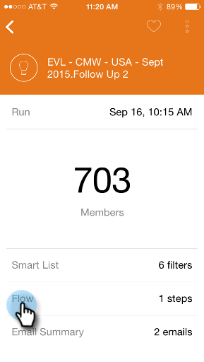
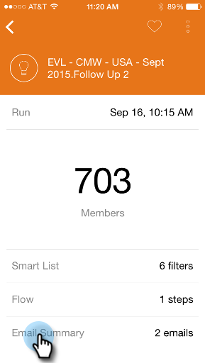
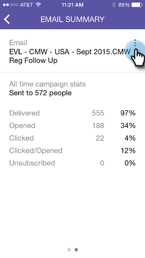
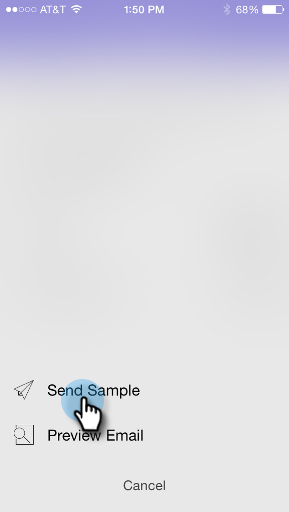
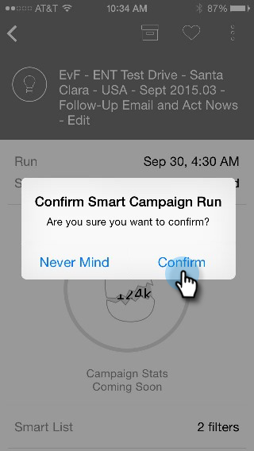
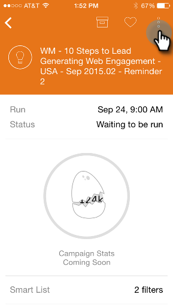
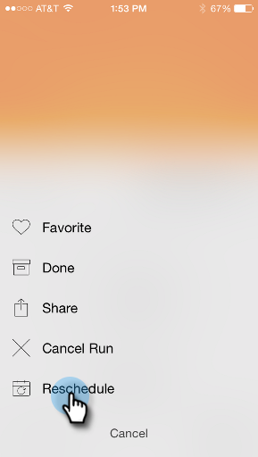
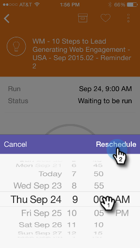

# Explicación de las tarjetas de campañas inteligentes {#understanding-smart-campaign-cards}

Utilice Momentos de Marketo para ver cada ejecución de sus campañas inteligentes desde su teléfono inteligente o iPad. La tarjeta Campaña inteligente Momentos de Marketo representa una sola ejecución de una campaña; cada vez que se ejecuta la campaña inteligente aparece una tarjeta nueva. Las tarjetas Smart Campaign están marcadas con una bombilla en la parte superior izquierda.

>[!IMPORTANT]
>
>El 2 de octubre de 2023, Adobe eliminó la aplicación Momentos de Marketo de todas las tiendas de aplicaciones. Si ya tiene la aplicación instalada en su tableta o dispositivo móvil, puede seguir utilizándola por el momento. Una vez que la instancia de Marketo Engage se haya migrado a Adobe Identity para la autenticación de Marketo, ya no podrá acceder a la aplicación. [Más información](https://nation.marketo.com/t5/product-discussions/marketo-events-app-and-marketo-moments-app-end-of-life/m-p/340712/highlight/true#M193869){target="_blank"}.

Para futuras campañas inteligentes programadas pero que aún no se han ejecutado, la tarjeta Momentos de Marketo aún no muestra estadísticas de campaña. Aparecerán en una versión futura.

## Tarjetas de campaña inteligentes {#smart-campaign-cards}

1. Pulse la tarjeta para abrir la tarjeta de detalles.

   

1. La tarjeta de detalles le da acceso a información sobre los filtros de [!UICONTROL Smart List], [!UICONTROL Flujo] y [!UICONTROL Resumen de correo electrónico].

1. Pulse **[!UICONTROL Lista inteligente]**.

   

1. Aquí se muestran los filtros utilizados por la lista inteligente.

   

1. Pulse **[!UICONTROL Flujo]**.

   

1. El flujo de la campaña inteligente se muestra aquí. Esta campaña solo tiene un paso de flujo, pero puede haber varios.

   

1. Haga clic en **[!UICONTROL Resumen de correo electrónico]**.

   

1. Ahora puede ver la respuesta del destinatario a cada correo electrónico, por número y porcentaje.

   

1. Los dos puntos de la parte inferior indican que hay dos correos electrónicos conectados a esta campaña inteligente. Para ver los resultados del otro correo electrónico, deslice la pantalla hacia la izquierda. Estos son los resultados del segundo correo electrónico.

   

   >[!NOTE]
   >
   >Observe que el otro punto está resaltado ahora.

## Creación de ejemplos de correo electrónico y previsualizaciones {#creating-email-samples-and-previews}

Es una buena idea echar un vistazo a un correo electrónico antes de que se publique. O bien, envíe una muestra a otra persona para que le eche un segundo vistazo.

1. Pulse el menú de acción de tres puntos en un correo electrónico.

   

1. Pulse [[!UICONTROL Enviar muestra]](/help/marketo/product-docs/core-marketo-concepts/mobile-apps/marketo-moments/working-with-moments/sending-a-sample.md) o [[!UICONTROL Previsualizar correo electrónico]](/help/marketo/product-docs/core-marketo-concepts/mobile-apps/marketo-moments/working-with-moments/previewing-an-email.md) (haga clic en estos vínculos para obtener detalles).

   

## Confirmación de una ejecución de campaña inteligente {#confirming-a-smart-campaign-run}

Las tarjetas de las campañas inteligentes sin confirmar aparecerán en gris hasta que las confirme. Luego, se vuelven naranjas.

1. Para confirmar una tarjeta de campaña inteligente sin confirmar, pulse el menú de acción de tres puntos.

   

1. Pulse **[!UICONTROL Confirmar]**.

   

1. Pulse **[!UICONTROL Confirmar]** para finalizar el trabajo o **[!UICONTROL No importa]** si tiene dudas.

   

   >[!NOTE]
   >
   >La tarjeta se volverá naranja.

## Cancelación de una ejecución de campaña inteligente {#canceling-a-smart-campaign-run}

Puede cancelar una ejecución de campaña inteligente programada y confirmada.

1. Pulse el menú de acción de tres puntos.

   

1. Pulse **[!UICONTROL Cancelar ejecución]**.

   

1. Pulse **Cancelar ejecución**. Si en el último minuto decide no cancelar la ejecución, pulse **No importa**, y la campaña inteligente se ejecutará según lo programado.

   

## Reprogramación de una campaña inteligente {#rescheduling-a-smart-campaign}

Puede reprogramar una campaña inteligente confirmada que aún no se haya ejecutado.

1. Pulse el menú de acción de tres puntos.

   

1. Pulse **[!UICONTROL Volver a programar]**.

   

1. Seleccione una fecha en el calendario y pulse **[!UICONTROL Reprogramar]**.

   

## Otras acciones de campañas inteligentes {#other-smart-campaign-actions}

Al igual que con otras tarjetas de Momentos de Marketo, puede pulsar los tres puntos de cualquier tarjeta de campaña inteligente o tarjeta de detalles para lo siguiente:

* [Conviértalo en favorito](/help/marketo/product-docs/core-marketo-concepts/mobile-apps/marketo-moments/working-with-moments/creating-a-favorite.md)
* [Marcar como listo](/help/marketo/product-docs/core-marketo-concepts/mobile-apps/marketo-moments/working-with-moments/marking-it-done.md)
* [Compártalo.](/help/marketo/product-docs/core-marketo-concepts/mobile-apps/marketo-moments/working-with-moments/sharing-a-moment.md)

>[!NOTE]
>
>También puede tocar el icono **[!UICONTROL Compartir]** en una tarjeta de Smart Campaign para compartirlo, y los iconos **[!UICONTROL Listo]** y **[!UICONTROL Favorito]** de la tarjeta de detalles.

## Eliminar rápidamente una tarjeta de campaña inteligente {#quickly-delete-a-smart-campaign-card}

Si tiene una tarjeta que ya no necesita, tal vez una que utilizó para la prueba, se puede eliminar con un rápido barrido a la izquierda o a la derecha.
