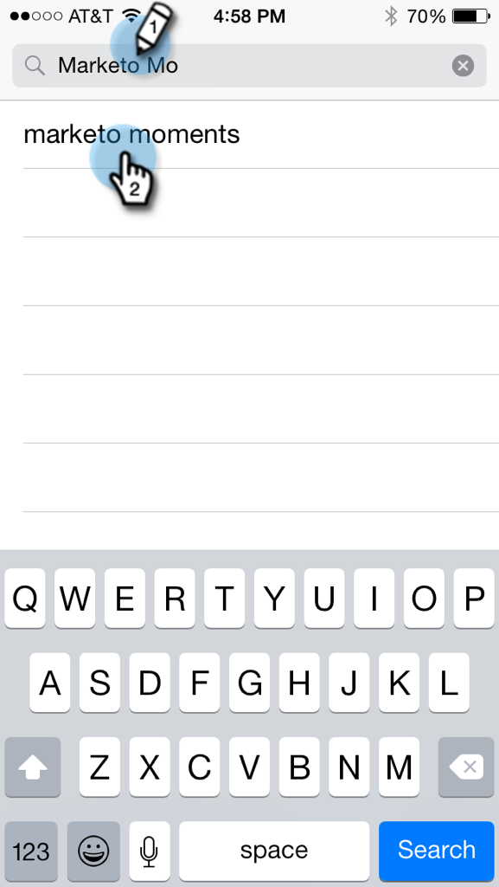
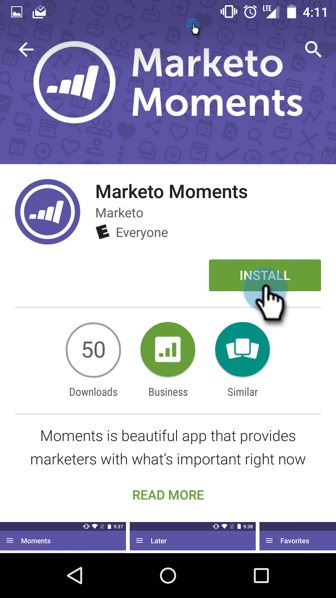

# Descarga de momentos de Marketo {#downloading-marketo-moments}

Descargue Momentos de Marketo desde el App Store o Google Play y ¡listo! La magia de Marketo en la palma de tu mano.

## Para iPhone {#for-iphone}

1. Vaya a la [App Store](https://itunes.apple.com/us/genre/ios/id36?mt=8).

   

1. Busque Momentos de Marketo y selecciónelo.

   

1. A continuación, pulse **Abrir**.

   

## Para Android {#for-android}

1. Ir a [Google Play](https://play.google.com/store?hl=en).

1. Busque Momentos de Marketo y pulse para descargar.

   

1. Tocar **Aceptar**.

   

1. Tocar **Instalar**.

   

¡Disfrútelo!

>[!NOTE]
>
>Inicie sesión con su nombre de usuario y contraseña normales de Marketo.
>
>El inicio de sesión único con lenguaje de marcado de aserción de seguridad (SAML) no es compatible con los momentos de Marketo.

>[!MORELIKETHIS]
>
>[Explicación de los momentos Marketo](/help/marketo/product-docs/core-marketo-concepts/mobile-apps/marketo-moments/understanding-moments/understanding-marketo-moments.md)
