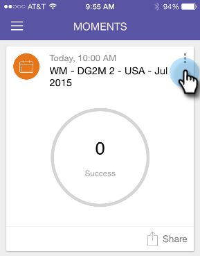

# Marcado Listo {#marking-it-done}

Marque una tarjeta de programa, evento o análisis de correo electrónico como Listo para eliminarla del flujo. Hay dos maneras de hacerlo.

1. Puntee en el menú de acción.

   

1. Toque **Listo**.

   

1. O bien, arrastre la tarjeta de cualquier forma.

   

   >[!NOTE]
   >
   >Al marcar una tarjeta como Listo, no se elimina el correo electrónico, el evento ni la campaña inteligente. Solo lo mueve del flujo Momentos/Más adelante al flujo Finalizado.

¡Un pedazo de torta!