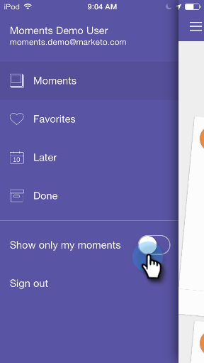

# Personalización de momentos Marketo {#personalizing-marketo-moments}

Cuando hay muchos programas de marketing y campañas inteligentes en marcha, resulta útil centrarse únicamente en su propio trabajo.

>[!IMPORTANT]
>
>El 2 de octubre de 2023, Adobe eliminó la aplicación Momentos de Marketo de todas las tiendas de aplicaciones. Si ya tiene la aplicación instalada en su tableta o dispositivo móvil, puede seguir utilizándola por el momento. Una vez que la instancia de Marketo Engage se haya migrado a Adobe Identity para la autenticación de Marketo, ya no podrá acceder a la aplicación. [Más información](https://nation.marketo.com/t5/product-discussions/marketo-events-app-and-marketo-moments-app-end-of-life/m-p/340712/highlight/true#M193869){target="_blank"}.

Habilite **[!UICONTROL Mostrar solo mis momentos]** para mostrar solo sus propios programas de correo electrónico y campañas inteligentes.

O bien, deshabilite **[!UICONTROL Mostrar solo mis momentos]** para ver todas las campañas inteligentes y los programas de correo electrónico a los que tenga acceso.

