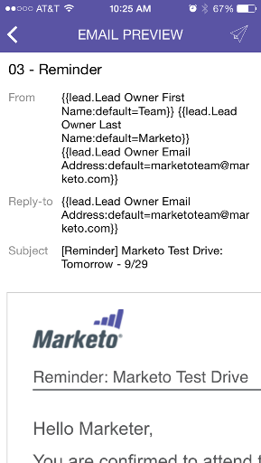

# Vista previa de un correo electrónico {#previewing-an-email}

Haga clic con el botón derecho en una tarjeta de correo electrónico para previsualizarla antes de extraer el déclencheur.

1. En una tarjeta de correo electrónico, pulse el menú de acción de tres puntos.

   

1. Pulse **Vista previa del correo electrónico**.

   

1. Puede ver el correo electrónico en el dispositivo.

   

   >[!NOTE]
   >
   >Para enviar una muestra directamente desde la página Vista previa del correo electrónico, pulse el icono del avión de papel en la esquina superior derecha.

   ¡Excelente!
