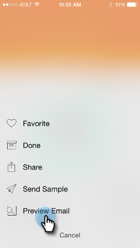

# Vista previa de un correo electrónico {#previewing-an-email}

Haga clic con el botón derecho en una tarjeta de correo electrónico para previsualizarla antes de enviarla.

>[!IMPORTANT]
>
>El 2 de octubre de 2023, Adobe eliminó la aplicación Momentos de Marketo de todas las tiendas de aplicaciones. Si ya tiene la aplicación instalada en su tableta o dispositivo móvil, puede seguir utilizándola por el momento. Una vez que la instancia de Marketo Engage se haya migrado a Adobe Identity para la autenticación de Marketo, ya no podrá acceder a la aplicación. [Más información](https://nation.marketo.com/t5/product-discussions/marketo-events-app-and-marketo-moments-app-end-of-life/m-p/340712/highlight/true#M193869){target="_blank"}.

1. En una tarjeta de correo electrónico, pulse el menú de acción de tres puntos.

   

1. Pulse **[!UICONTROL Previsualizar correo electrónico]**.

   

1. Puede ver el correo electrónico en su dispositivo.

   

   >[!NOTE]
   >
   >Para enviar una muestra directamente desde la página Vista previa de correo electrónico, pulse el icono avión de papel en la parte superior derecha.
