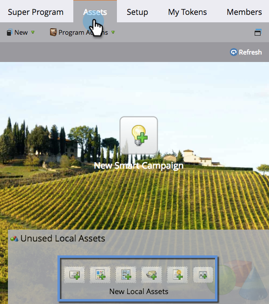

# Uso de la ficha Recursos {#using-the-assets-tab}

El lienzo de recursos es una representación visual del programa. Puede utilizarla para añadir recursos locales e interactuar con los existentes.

## Adición de recursos {#adding-assets}

En el **Actividades de marketing** , haga clic en el **Recursos** pestaña . Elija cualquiera de los recursos siguientes y agréguelos a su programa.

## Administrar el programa  {#manage-your-program}

Cuando haya activos en su programa, los verá listados aquí.

| Naranja | Campaña desencadenadora |
|---|---|
| Verde | Campaña por lote |

Puede hacer clic con el botón derecho en el encabezado si desea interactuar con ese recurso.

>[!TIP]
>
>Arrastre y suelte para reorganizar las columnas de recursos.

Los recursos que no sean locales para el programa tendrán este aspecto:

La pestaña assets es un tablero pequeño y bueno para todo lo que hay dentro del programa y al que se hace referencia en él.
