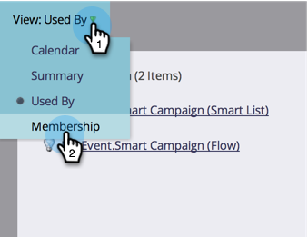
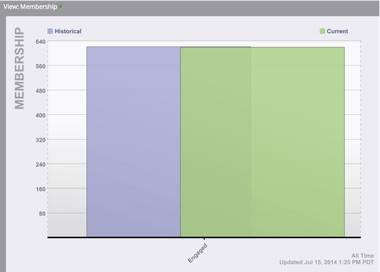

# Uso de la pestaña Inicio del programa {#using-the-program-home-tab}

La pestaña Inicio del programa le ofrece una vista de alto nivel de lo que sucede en el programa.

## Vista de resumen {#summary-view}

1. Vaya a **[!UICONTROL Actividades de marketing]**.

   

1. Seleccione un programa.

   

   >[!NOTE]
   >
   >Esta es la vista predeterminada. Proporciona información sobre la configuración, horario, resultados y estado del programa de los miembros.

1. Haga clic en elementos subrayados para realizar cambios o ver más información.

   

1. Haga clic en **[!UICONTROL Exportar]** en la parte inferior del informe Resumen para descargar.

   

## Utilizado por la vista {#used-by-view}

1. En **[!UICONTROL Actividades de marketing]**, seleccione un programa.

   

1. Haga clic en la lista desplegable **[!UICONTROL Ver]**. Seleccionar **[!UICONTROL Utilizado Por]**.

   

   Esta vista muestra qué campañas inteligentes se están utilizando.

   

## Vista de abono {#membership-view}

1. En **[!UICONTROL Actividades de marketing]**, seleccione un programa.

   

1. Haga clic en la lista desplegable **[!UICONTROL Ver]**. Seleccione **[!UICONTROL Pertenencia]**.

   

   Esto muestra un gráfico de dónde se encuentran los miembros a medida que se desplazan por los estados de los programas.

   

   >[!NOTE]
   >
   >**[!UICONTROL Histórico]** significa cualquiera que haya pasado por el programa, mientras que **[!UICONTROL Actual]** solo incluye a las personas que actualmente están en el programa.

   >[!MORELIKETHIS]
   >
   >[Descripción del abono al programa](/help/marketo/product-docs/core-marketo-concepts/programs/creating-programs/understanding-program-membership.md){target="_blank"}
