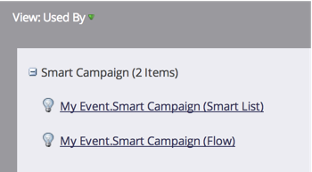

# Uso de la ficha Inicio de Programa {#using-the-program-home-tab}

La ficha de inicio del programa le proporciona una vista de alto nivel de lo que sucede en su programa.

## Vista de resumen {#summary-view}

1. Vaya a **Actividades de marketing**.

   

1. Seleccione un programa.

   

   >[!NOTE]
   >
   >Ésta es su vista predeterminada. Proporciona información sobre la configuración, la programación, los resultados y el estado de Programa de los miembros.

1. Haga clic en los elementos subrayados para realizar cambios o vista de más información.

   

1. Haga clic en **Exportar** en la parte inferior del resumen para descargar el informe.

   

## Utilizado por la Vista {#used-by-view}

1. En Actividades de marketing, seleccione un programa.

   

1. Haga clic en la lista desplegable **Vista**. Seleccione **Utilizado por**.

   

   Esta vista muestra las campañas inteligentes en uso.

   

## Vista de membresía {#membership-view}

1. En Actividades de marketing, seleccione un programa.

   

1. Haga clic en la lista desplegable **Vista**. Seleccione **Membresía**.

   

   Muestra un gráfico de dónde se encuentran los miembros a medida que avanzan por los estados de programa.

   

   >[!NOTE]
   >
   >**** Histórico significa que cualquiera que haya pasado por el programa, mientras que  **** Actualmente solo incluye personas que están actualmente en el programa.

   >[!MORELIKETHIS]
   >
   >[Explicación de la pertenencia a Programa](/help/marketo/product-docs/core-marketo-concepts/programs/creating-programs/understanding-program-membership.md)
