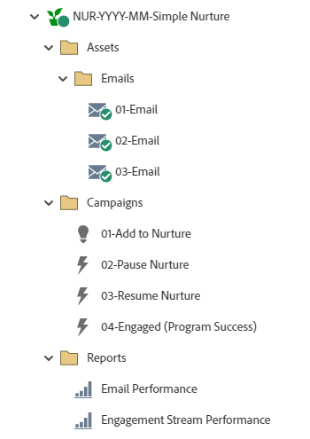

# NUR-AAAA-MM-Nutrición simple {#nur-yyyy-mm-simple-nurture}

Este es un ejemplo de programas de nutrición sencillos, que utilizan el programa de participación de Marketo Engage, con contenido cadenciado para que gotee a lo largo del tiempo en la base de datos, mientras utiliza flujos para guiar los registros a través de los recorridos basados en la conducta.

Para obtener más ayuda sobre la estrategia o para personalizar un programa, comuníquese con el equipo de cuenta de Adobe o visite la página de [Adobe Professional Services](https://business.adobe.com/es/customers/consulting-services/main.html){target="_blank"}.

## Resumen del canal {#channel-summary}

<table style="table-layout:auto">
 <tbody>
  <tr>
   <th>Canal</th>
   <th>Estado de abono</th>
   <th>Comportamiento de análisis</th>
   <th>Tipo de programa</th>
  </tr>
  <tr>
   <td>Acompañamiento</td>
   <td>01 - Miembro
 02 - Participado - Correcto</td>
   <td>Incluido</td>
   <td>Participación</td>
  </tr>
 </tbody>
</table>

## El programa contiene el siguiente Assets {#program-contains-the-following-assets}

<table style="table-layout:auto">
 <tbody>
  <tr>
   <th>Tipo</th>
   <th>Nombre de plantilla</th>
   <th>Nombre del recurso</th>
  </tr>
  <tr>
   <td>Correo electrónico</td>
   <td><a href="/help/marketo/product-docs/core-marketo-concepts/programs/program-library/quick-start-email-template.md" target="_blank">Plantilla de correo electrónico de inicio rápido</a></td>
   <td>01 - Correo electrónico</td>
  </tr>
   <tr>
   <td>Correo electrónico</td>
   <td><a href="/help/marketo/product-docs/core-marketo-concepts/programs/program-library/quick-start-email-template.md" target="_blank">Plantilla de correo electrónico de inicio rápido</a></td>
   <td>02 - Correo electrónico</td>
  </tr>
   <tr>
   <td>Correo electrónico</td>
   <td><a href="/help/marketo/product-docs/core-marketo-concepts/programs/program-library/quick-start-email-template.md" target="_blank">Plantilla de correo electrónico de inicio rápido</a></td>
   <td>03 - Correo electrónico</td>
  </tr>
  <tr>
   <td>Informe local</td>
   <td> </td>
   <td>Desempeño de email</td>
  </tr>
  <tr>
   <td>Informe local</td>
   <td> </td>
   <td>Desempeño de la secuencia de participación</td>
  </tr>
  <tr>
  <tr>
   <td>Campaña inteligente</td>
   <td> </td>
   <td>01 - Añadir a Nutrir</td>
  </tr>
  <tr>
   <td>Campaña inteligente</td>
   <td> </td>
   <td>02 - Pausar Nutrición</td>
  </tr>
  <tr>
   <td>Campaña inteligente</td>
   <td> </td>
   <td>03 - Reanudar la nutrición</td>
  </tr>
  <tr>
   <td>Campaña inteligente</td>
   <td> </td>
   <td>04 - Participación (éxito del programa)</td>
  </tr>
  <tr>
   <td>Carpeta</td>
   <td> </td>
   <td>Assets: aloja todos los recursos creativos
    (subcarpetas para correos electrónicos)</td>
  </tr>
  <tr>
   <td>Carpeta</td>
   <td> </td>
   <td>Campañas: aloja todas las campañas inteligentes</td>
  </tr>
  <tr>
   <td>Carpeta</td>
   <td> </td>
   <td>Informes</td>
  </tr>
 </tbody>
</table>

## Mis tokens incluidos {#my-tokens-included}

<table style="table-layout:auto">
 <tbody>
  <tr>
   <th>Tipo de token</th>
   <th>Nombre del token</th>
   <th>Valor</th>
  </tr>
  <tr>
   <td>Texto</td>
   <td><code>{{my.Email-FromAddress}}</code></td>
   <td>PlaceholderFrom.email@mydomain.com</td>
  </tr>
  <tr>
   <td>Texto</td>
   <td><code>{{my.Email-FromName}}</code></td>
   <td><code><--My From Name Here--></code></td>
  </tr>
  <tr>
   <td>Texto</td>
   <td><code>{{my.Email-ReplyToAddress}}</code></td>
   <td>reply-to.email@mydomain.com</td>
  </tr>
 </tbody>
</table>

## Reglas de conflicto {#conflict-rules}

* **Etiquetas de programas**
   * Crear etiquetas en esta suscripción: _Recomendado_
   * Ignorar

* **Plantilla de página de aterrizaje con el mismo nombre**
   * Copiar plantilla original
   * Usar plantilla de destino: _Recomendado_

* **Imágenes con el mismo nombre**
   * Conservar ambos archivos
   * Reemplazar elemento en esta suscripción: _Recomendado_

* **Plantillas de correo electrónico con el mismo nombre**
   * Conservar ambas plantillas
   * Reemplazar plantilla existente: _Recomendado_

## Mejores prácticas {#best-practices}

* Considere la posibilidad de actualizar las plantillas del programa importado para utilizar plantillas con marca actual o actualizar la plantilla recién importada para reflejar su marca añadiendo un fragmento o la información del logotipo/pie de página correspondiente.

* Considere la posibilidad de actualizar la convención de nombres de este ejemplo de programa para que se ajuste a la convención de nombres.

* Asegúrese de que dispone de reglas para pausar y reanudar la cadencia de nutrición. Estas campañas inteligentes deben activarse o programarse antes de activar el programa de participación.

>[!NOTE]
>
>Recuerde actualizar los valores de Mi token en la plantilla de programa y cada vez que utilice el programa, según sea necesario.

>[!TIP]
>
>Active la campaña &quot;04 - Participación (éxito del programa)&quot; para rastrear el éxito antes de que el formulario esté activo y se envíen correos electrónicos.
