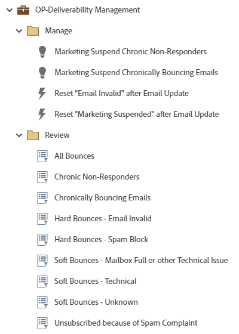

# OP-Administración de la capacidad de entrega {#op-deliverability-management}

Este es un ejemplo de flujos de trabajo de prácticas recomendadas de administración de envíos que utilizan un programa predeterminado de Marketo Engage para revisar el estado actual de la capacidad de envío de correos electrónicos y administrar devoluciones crónicas y no respondedores.

>[!NOTE]
>
>Requiere el campo de cadena personalizado &quot;Motivo de suspensión de marketing&quot; para importar. [Más información](https://nation.marketo.com/community/product_and_support/support_solutions/blog/2016/04/18/how-to-monitor-deliverability-using-marketo){target="_blank"}.

Para obtener más ayuda sobre la estrategia o para personalizar un programa, comuníquese con el equipo de cuenta de Adobe o visite la página de [Adobe Professional Services](https://business.adobe.com/customers/consulting-services/main.html){target="_blank"}.

## Resumen del canal {#channel-summary}

<table style="table-layout:auto">
 <tbody>
  <tr>
   <th>Canal</th>
   <th>Estado de abono</th>
   <th>Comportamiento de análisis</th>
   <th>Tipo de programa</th>
  </tr>
  <tr>
   <td>Operativo</td>
   <td>Miembro 01</td>
   <td>Operativo</td>
   <td>Predeterminado</td>
  </tr>
 </tbody>
</table>

## Campos de requisitos previos {#prerequisite-fields}

<table style="table-layout:auto">
 <tbody>
  <tr>
   <th>Tipo</th>
   <th>Nombre descriptivo</th>
   <th>Nombre de API</th>
  </tr>
  <tr>
   <td>Cadena</td>
   <td>Motivo de suspensión de marketing</td>
   <td>MarketingSuspendedReason</td>
  </tr>
 </tbody>
</table>

## El programa contiene el siguiente Assets {#program-contains-the-following-assets}

<table style="table-layout:auto">
 <tbody>
  <tr>
   <th>Tipo</th>
   <th>Nombre de plantilla</th>
   <th>Nombre del recurso</th>
  </tr>
  <tr>
   <td>Campaña inteligente</td>
   <td> </td>
   <td>Marketing Suspender Respondedores Crónicos No Respondidos</td>
  </tr>
  <tr>
   <td>Campaña inteligente</td>
   <td> </td>
   <td>Marketing suspende el rebote crónico de correos electrónicos</td>
  </tr>
  <tr>
   <td>Campaña inteligente</td>
   <td> </td>
   <td>Restablecer "Correo electrónico no válido" después de actualizar el correo electrónico</td>
  </tr>
  <tr>
   <td>Campaña inteligente</td>
   <td> </td>
   <td>Restablecer "Marketing suspendido" después de actualizar el correo electrónico</td>
  </tr>
  <tr>
   <td>Carpeta</td>
   <td> </td>
   <td>Administrar</td>
  </tr>
  <tr>
   <td>Carpeta</td>
   <td> </td>
   <td>Revisar</td>
  </tr>
 </tbody>
</table>

## Reglas de conflicto {#conflict-rules}

* **Etiquetas de programas**
   * Crear etiquetas en esta suscripción: _Recomendado_
   * Ignorar

* **Plantilla de página de aterrizaje con el mismo nombre**
   * Copiar plantilla original: _Recomendado_
   * Usar plantilla de destino

* **Imágenes con el mismo nombre**
   * Conservar ambos archivos: _Recomendado_
   * Reemplazar elemento en esta suscripción

* **Plantillas de correo electrónico con el mismo nombre**
   * Mantener ambas plantillas: _Recomendado_
   * Reemplazar plantilla existente

## Mejores prácticas {#best-practices}

* Cada campaña creada debe ser un ejemplo sobre la compilación de la práctica recomendada y no específica para sus casos de uso. Recuerde actualizar las campañas inteligentes para abordar sus puntos problemáticos específicos y los desafíos en materia de datos.

* Considere la posibilidad de actualizar la convención de nombres de este ejemplo de programa para que se ajuste a la convención de nombres.
