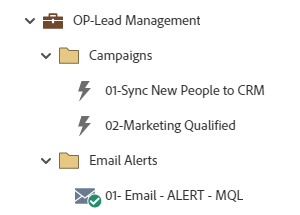

# Administración de OP-Lead {#op-lead-management}

Este es un ejemplo de flujos de trabajo de prácticas recomendadas de administración de posibles clientes, que utilizan un programa predeterminado de Marketo Engage para ayudarle a administrar los registros de la base de datos de Marketo Engage en su CRM.

>[!NOTE]
>
>En Marketo Engage, los registros de la base de datos se denominan personas/persona. La administración de posibles clientes en este ejemplo hace referencia a los registros de su CRM.

Para obtener más ayuda sobre la estrategia o para personalizar un programa, póngase en contacto con el equipo de cuenta de Adobe o visite el [Adobe Professional Services](https://business.adobe.com/customers/consulting-services/main.html) página.

## Resumen del canal {#channel-summary}

<table style="table-layout:auto"> 
 <tbody> 
  <tr> 
   <th>Canal</th> 
   <th>Estado de abono</th>
   <th>Comportamiento de análisis</th>
   <th>Tipo de programa</th>
  </tr> 
  <tr> 
   <td>Operativo</td> 
   <td>Miembro 01</td>
   <td>Operativo</td>
   <td>Predeterminado</td>
  </tr>
 </tbody> 
</table>

## El programa contiene los siguientes recursos {#program-contains-the-following-assets}

<table style="table-layout:auto"> 
 <tbody> 
  <tr> 
   <th>Tipo</th> 
   <th>Nombre de plantilla</th>
   <th>Nombre del recurso</th>
  </tr> 
  <tr> 
   <td>Campaña inteligente</td> 
   <td> </td>
   <td>01: Sincronizar nuevas personas con CRM</td>
  </tr>
  <tr> 
   <td>Campaña inteligente</td> 
   <td> </td>
   <td>02 - Marketing cualificado</td>
  </tr>
  <tr> 
   <td>Correo electrónico</td> 
   <td><a href="/help/marketo/product-docs/core-marketo-concepts/programs/program-library/quick-start-email-template.md" target="_blank">Plantilla de correo electrónico de inicio rápido</a></td>
   <td>01: Correo electrónico, ALERTA, MQL</td>
  </tr>
  <tr> 
   <td>Carpeta</td> 
   <td> </td>
   <td>Campañas</td>
  </tr>
  <tr> 
   <td>Carpeta</td> 
   <td> </td>
   <td>Alerta de correo electrónico</td>
  </tr>
 </tbody> 
</table>

## Reglas de conflicto {#conflict-rules}

* **Etiquetas del programa**
   * Crear etiquetas en esta suscripción: _Recomendado_
   * Ignorar

* **Plantilla de página de aterrizaje con el mismo nombre**
   * Copiar plantilla original - _Recomendado_
   * Usar plantilla de destino

* **Imágenes con el mismo nombre**
   * Mantener ambos archivos - _Recomendado_
   * Reemplazar elemento en esta suscripción

* **Plantillas de email con el mismo nombre**
   * Mantener ambas plantillas - _Recomendado_
   * Reemplazar plantilla existente

## Prácticas recomendadas {#best-practices}

* Considere la posibilidad de agregar campañas inteligentes adicionales para abordar cada una de las necesidades de estado del ciclo vital que pueda estar rastreando en su organización. Cada campaña creada en este programa está pensada para ser un ejemplo de la compilación de las prácticas recomendadas y no específica para todos los casos de uso. Recuerde actualizar las campañas inteligentes para abordar el proceso de administración del ciclo de vida del posible cliente específico.

* Considere la posibilidad de actualizar la convención de nombres de este ejemplo de programa para que se ajuste al suyo.
