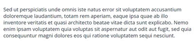

# Plantilla de correo electrónico de inicio rápido {#quick-start-email-template}

Algunos de los programas iniciales de la Biblioteca de referencia del Marketo Engage contienen una plantilla de correo electrónico sencilla, fácil de usar y personalizable que permite crear correos electrónicos rápidamente en una serie de casos de uso de marketing.

El editor de correo electrónico del Marketo Engage incluye funciones que le ayudan a cambiar el diseño y editar el contenido de los correos electrónicos.

* **Módulos**: Bloques de contenido arrastrables y desplegables que se codifican en la plantilla. Se pueden reorganizar y duplicar.

* **Elementos de texto**: puede utilizar el editor para actualizar, copiar, cambiar estilos de fuente o agregar vínculos.

* **Elementos de imagen**: al igual que los elementos de texto, las imágenes se pueden intercambiar, vincular y cambiar de tamaño.

* **Variables**: Cuando se selecciona un módulo, las variables aparecen en el lado derecho del editor. Se pueden utilizar para ajustar atributos del módulo que no se pueden editar fácilmente mediante elementos de imagen o texto.

Para obtener más ayuda sobre la estrategia o para personalizar un programa, póngase en contacto con el equipo de cuenta de Adobe o visite el [Adobe Professional Services](https://business.adobe.com/customers/consulting-services/main.html){target="_blank"} página.

## Resumen de módulos {#modules-summary}

### Módulo de logotipo {#logo-module}

* Incluye un elemento de imagen para actualizar el logotipo
* Incluye variables para controlar:
   * Relleno superior del módulo
   * Margen inferior del módulo
   * Color de fondo del módulo
   * Alineación del logotipo
* 

### Módulo de imagen {#image-module}

* Incluye un elemento de imagen para actualizar la imagen
* Incluye variables para controlar:
   * Relleno superior del módulo
   * Margen inferior del módulo
   * Color de fondo del módulo
* 

### Módulo de encabezado {#headline-module}

* Incluye un elemento de texto para actualizar el titular
* Incluye variables para controlar:
   * Relleno superior del módulo
   * Margen inferior del módulo
   * Color de fondo del módulo
   * Tamaño de la fuente del titular (que también se puede editar en el editor de texto enriquecido)
   * Color de la fuente del titular (esto también se puede editar en el editor de texto enriquecido)
   * Alineación del texto del titular (esto también se puede editar en el editor de texto enriquecido)
* 

### Módulo de subtitular {#subheadline-module}

* Incluye un elemento de texto para actualizar el subtitular
* Incluye variables para controlar:
   * Relleno superior del módulo
   * Margen inferior del módulo
   * Color de fondo del módulo
   * Tamaño de la fuente del subtítulo (que también se puede editar en el editor de texto enriquecido)
   * Color de la fuente del subtítulo (este también se puede editar en el editor de texto enriquecido)
   * Alineación del texto del subtítulo (también se puede editar en el editor de texto enriquecido)
* 

### Módulo de texto libre {#free-text-module}

* Incluye un elemento de texto para actualizar el texto
* Incluye variables para controlar:
   * Relleno superior del módulo
   * Margen inferior del módulo
   * Color de fondo del módulo
   * Tamaño de fuente del texto (también se puede editar en el editor de texto enriquecido)
   * Color de la fuente del texto (esto también se puede editar en el editor de texto enriquecido)
   * Alineación del texto (esto también se puede editar en el editor de texto enriquecido)
* 

### Módulo CTA {#cta-module}

* Incluye variables para controlar:
   * Relleno superior del módulo
   * Margen inferior del módulo
   * Color de fondo del módulo
   * Color de texto CTA
   * Color de fondo CTA
   * Color de borde CTA
   * Radio de borde CTA (para redondear los botones) **Nota**: esta función no funciona en los clientes de correo electrónico de Microsoft Outlook)
   * URL DE CTA
   * Texto CTA
   * Alineación CTA
* 

### Módulo divisor {#divider-module}

* Incluye variables para controlar:
   * Relleno superior del módulo
   * Margen inferior del módulo
   * Color de fondo del módulo
   * Color de divisor
   * Altura del divisor (en píxeles)
   * Anchura del divisor (en %)
* 

### Módulo de pie {#footer-module}

* Elemento de texto que se puede utilizar para intercambiar o vincular iconos sociales
* Elemento de texto para actualizar el idioma del pie de página
* Incluye variables para controlar:
   * Relleno superior del módulo
   * Margen inferior del módulo
   * Color de fondo del módulo
   * Color del texto
   * Alineación de contenido
* 
