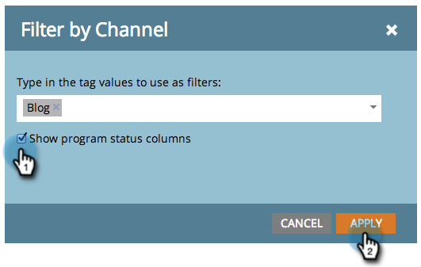

# Añadir columnas de estado del programa a un informe de programa {#add-program-status-columns-to-a-program-report}

Agrega estadísticas sobre el estado del programa a tu [informe de rendimiento del programa](/help/marketo/product-docs/core-marketo-concepts/programs/program-performance-report/create-a-program-performance-report.md){target="_blank"}.

1. Vaya a **[!UICONTROL Actividades de marketing]** (o a **[!UICONTROL Analytics]**).

   

1. Seleccione el informe.

   

1. Haga clic en la ficha **[!UICONTROL Configuración]** y arrastre el cursor sobre la etiqueta **[!UICONTROL Canal]**.

   

1. Seleccione un canal por el que filtrar.

   

   >[!TIP]
   >
   >Para mostrar las columnas de estado del programa, el informe debe filtrarse por _un solo canal_.

1. Marque la opción para Mostrar columnas de estado del programa. Haga clic en **[!UICONTROL Aplicar]**.

   

1. Haga clic en la ficha [!UICONTROL Informe] para ver el informe con las columnas de estado del programa.

   

>[!NOTE]
>
>Si no ve una columna para cada estado en el programa, asegúrese de haber [seleccionado las columnas que desea mostrar](/help/marketo/product-docs/reporting/basic-reporting/editing-reports/select-report-columns.md){target="_blank"} en el informe.

>[!MORELIKETHIS]
>
>[Filtrar un informe de programa por etiqueta](/help/marketo/product-docs/core-marketo-concepts/programs/program-performance-report/filter-a-program-report-by-tag.md){target="_blank"}
