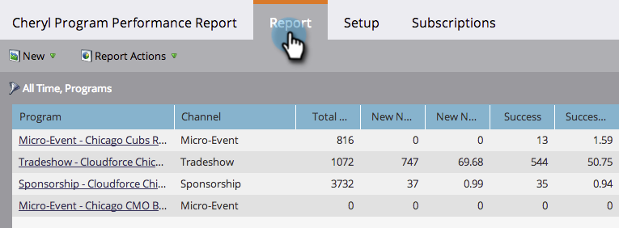

# Filtrar un informe de programa por Programa {#filter-a-program-report-by-program}

Enfoque su [informe de rendimiento del programa](/help/marketo/product-docs/core-marketo-concepts/programs/program-performance-report/create-a-program-performance-report.md) en programas específicos para comparar su rendimiento.

1. Vaya a **Marketing** **Actividades** (o **Analytics**).

   

1. Seleccione el informe de rendimiento del programa.

   

1. Haga clic en la pestaña **Setup** y arrastre **Programs**.

   

1. Elija las carpetas y los programas específicos que desea incluir en el informe.

   

   >[!TIP]
   >
   >Si selecciona una carpeta, el informe incluirá todo lo que contenga la carpeta en el momento en que se ejecute el informe.

1. ¡Eso es todo! Haga clic en la pestaña **Report** para ver _just_ los programas seleccionados en el informe.

   

   >[!NOTE]
   >
   >[Filtrado de informes de programa por etiqueta](/help/marketo/product-docs/core-marketo-concepts/programs/program-performance-report/filter-a-program-report-by-tag.md)
