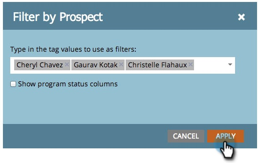

# Filtrado de informes de programa por etiqueta {#filter-a-program-report-by-tag}

Céntrese en [informe de ejecución del programa](/help/marketo/product-docs/core-marketo-concepts/programs/program-performance-report/create-a-program-performance-report.md) en específico [etiquetas](/help/marketo/product-docs/core-marketo-concepts/programs/working-with-programs/understanding-tags.md).

1. Vaya a **Marketing** **Actividades** (o **Analytics**).

   

1. Seleccione su **Rendimiento del programa** informe.

   

1. Haga clic en el **Configuración** y arrastre una de las **Etiquetas** filtros.

   

1. Elija los valores de etiqueta que desea incluir en el informe.

   

1. Haga clic en **Aplicar**.

   

1. Listo! Haga clic en el **Informe** para ver _just_ los programas que coinciden con las etiquetas seleccionadas en el informe.

   

   >[!NOTE]
   >
   >[Filtrar un informe de programa por costo de período](/help/marketo/product-docs/core-marketo-concepts/programs/program-performance-report/filter-a-program-report-by-period-cost.md)
