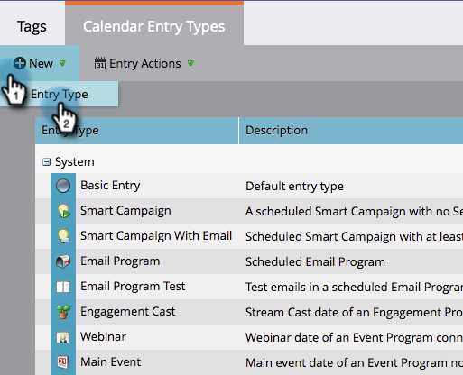

# Crear tipos de entrada personalizados {#create-custom-entry-types}

Puede crear tipos de entrada personalizados para utilizarlos en la Vista de Calandario del programa. Esto le permitirá realizar un seguimiento de todos los temas de la agenda que no son de marketing y que afectan a su programa.

1. Vaya a la sección **Administración** y haga clic en **Etiquetas**.

   

1. Haga clic en **Tipo de entrada de calendario**.

   

1. Haga clic en la lista desplegable **Nuevo** y seleccione **Tipo de entrada**.

   

1. Asigne un nombre a la entrada y seleccione un icono.

   

1. Seleccione un **Color de entrada**.

   

1. Haga clic en **Guardar**.

   

¡bueno! Ahora, cuando cree una nueva entrada en la vista de programación, este tipo será una opción.

>[!NOTE]
>
>Puede crear hasta 100 tipos de entrada personalizados.

