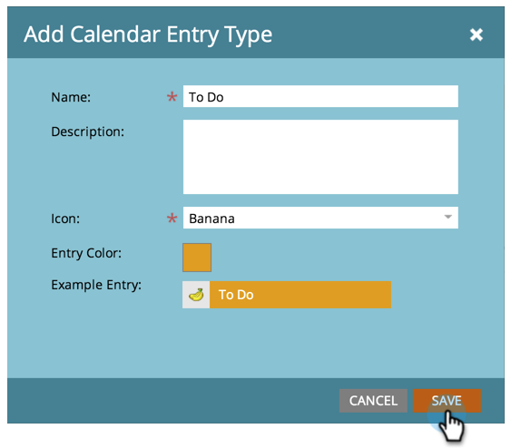

# Crear tipos de entrada personalizados {#create-custom-entry-types}

Puede crear tipos de entradas personalizadas para usarlas en la vista Programación del programa. Esto le permitirá realizar un seguimiento de todos los elementos de la agenda que no sean de Marketo y que afecten a su programa.

1. Vaya a la sección **[!UICONTROL Admin]** y haga clic en **[!UICONTROL Etiquetas]**.

   

1. Haga clic en **[!UICONTROL Tipo de entrada de calendario]**.

   

1. Haga clic en el menú desplegable **[!UICONTROL Nuevo]** y seleccione **[!UICONTROL Tipo de entrada]**.

   

1. Asigne un nombre a la entrada y seleccione un icono.

   

1. Seleccionar un **[!UICONTROL color de entrada]**.

   

1. Haga clic en **[!UICONTROL Guardar]**.

   

¡Excelente! Ahora, cuando cree una nueva entrada en la vista de programación, este tipo será una opción.

>[!NOTE]
>
>Puede crear hasta 100 tipos de entradas personalizadas.
