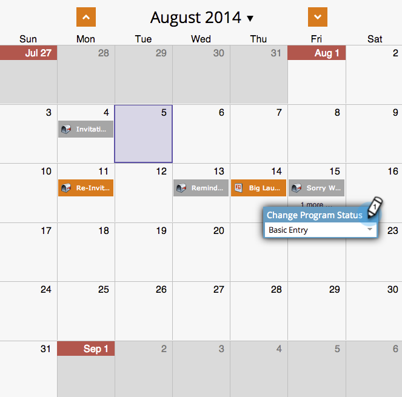

# Creación de una campaña inteligente por lotes en la vista de programación del programa {#creating-a-batch-smart-campaign-in-the-program-schedule-view}

Puede crear nuevas campañas inteligentes y [volver a ejecutar las existentes](/help/marketo/product-docs/core-marketo-concepts/programs/program-schedule-view/rerun-a-smart-campaign-in-the-program-schedule-view.md) dentro del programa desde la vista de programación del programa.

>[!NOTE]
>
>En esta vista solo se pueden crear campañas inteligentes por lotes. No se admiten campañas de déclencheur.

1. Seleccione la fecha en la que desea ejecutar la nueva campaña inteligente.

   

1. Elija un nombre para la entrada, que se convertirá en la nueva campaña inteligente. Pulse la tecla **Enter/Return** para confirmar el nombre.

   

1. Haga clic en la lista desplegable **Type** y seleccione **Smart Campaign**.

   

   >[!NOTE]
   >
   >También puede ejecutar una campaña inteligente existente seleccionándola en la lista desplegable.

   

1. Elija las reglas de [campaña inteligente](/help/marketo/product-docs/core-marketo-concepts/smart-campaigns/creating-a-smart-campaign/create-a-new-smart-campaign.md).

   

1. Ahora verá esta campaña inteligente tal como se confirma en la vista de programación y en los detalles de entrada.

   

Esto creará una nueva campaña inteligente que se ejecutará en su programa.
