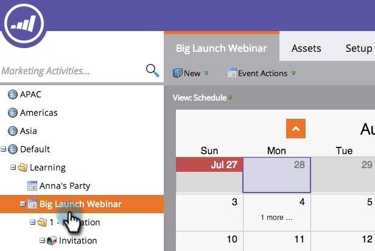

# Creación de un nuevo programa de correo electrónico en la vista de programación {#creating-a-new-email-program-in-the-schedule-view}

Puede crear un programa de correo electrónico desde la vista de programación del programa. Así es como.

1. Vaya a **Marketing Activities**.

   

1. Seleccione el programa.

   

1. Seleccione la fecha en la que desea que se ejecute el programa de correo electrónico.

   

1. Introduzca un nombre. Seleccione **Email Program**.

   

1. En los detalles de la entrada, haga clic en el vínculo a su nuevo programa de correo electrónico.

   

1. [Configure su ](/help/marketo/product-docs/email-marketing/email-programs/creating-an-email-program/create-an-email-program.md) programa de correo electrónico y haga clic en  **Aprobar programa**.

   

   Además del panel detallado, la ventaja de utilizar un [programa de correo electrónico](/help/marketo/product-docs/email-marketing/email-programs/creating-an-email-program/understanding-email-programs.md) en lugar de una campaña inteligente es la capacidad de implementar fácilmente una [prueba A/B](/help/marketo/product-docs/email-marketing/email-programs/email-program-actions/email-test-a-b-test/add-an-a-b-test.md). ¡Disfrútelo!
