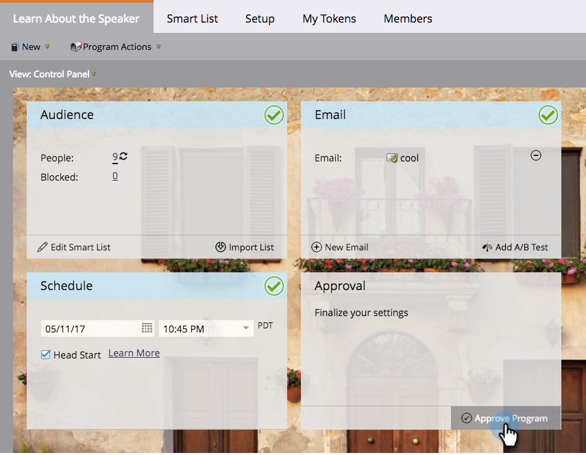

# Creación de un nuevo programa de correo electrónico en la vista de Programación {#creating-a-new-email-program-in-the-schedule-view}

Puede crear un programa de correo electrónico desde la vista de programación del programa. Así es cómo se hace.

1. Vaya a **[!UICONTROL Actividades de marketing]**.

   

1. Seleccione el programa.

   

1. Seleccione la fecha en la que desea ejecutar el programa de correo electrónico.

   

1. Introduzca un nombre. Seleccione **[!UICONTROL Programa de correo electrónico]**.

   

1. En los detalles de la entrada, haga clic en el vínculo al nuevo programa de correo electrónico.

   

1. [Configure su programa de correo electrónico](/help/marketo/product-docs/email-marketing/email-programs/creating-an-email-program/create-an-email-program.md){target="_blank"} y haga clic en **[!UICONTROL Aprobar programa]**.

   

   Además del tablero detallado, una ventaja de usar un [programa de correo electrónico](/help/marketo/product-docs/email-marketing/email-programs/creating-an-email-program/understanding-email-programs.md){target="_blank"} en lugar de una campaña inteligente es la capacidad de implementar fácilmente una prueba [A/B](/help/marketo/product-docs/email-marketing/email-programs/email-program-actions/email-test-a-b-test/add-an-a-b-test.md){target="_blank"}. ¡Disfrútelo!
