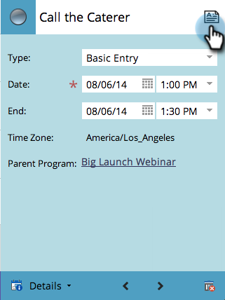

# Creación de una entrada en la Vista Calandario del programa {#creating-an-entry-in-the-program-schedule-view}

Puede crear entradas desde la vista de calandario del programa para complementar un programa existente.

## Crear una entrada básica {#create-a-basic-entry}

1. Vaya a **Actividades de marketing**.

   

1. Seleccione su programa. Haga clic en la lista desplegable **Vista**. Seleccione **Programar**.

   

1. Haga clic en un día para agregar la entrada.

   

1. Asigne un nombre a la entrada. Presione **Intro** para confirmar el nombre.

   

1. Seleccione el inicio y la fecha y hora de finalización de la nueva entrada.

   

1. Haga clic en el icono de descripción para agregar información adicional.

   

1. Escriba la descripción y haga clic en **Guardar**.

   

1. Pase el ratón sobre el icono de descripción para vista de la descripción de la entrada.

   

## Cambiar tipo de entrada {#change-entry-type}

1. Seleccione una entrada básica en la vista **Agenda**.

   

1. Seleccione la lista desplegable **Tipo**. Elija un nuevo tipo de entrada.

   >[!NOTE]
   >
   >El procedimiento es una [entrada personalizada](/help/marketo/product-docs/core-marketo-concepts/programs/program-schedule-view/create-custom-entry-types.md). Puede realizar tareas y otras entradas personalizadas para realizar un seguimiento de los elementos de la agenda que no sean de marketing.

   

   ¡Genial! Debe ver los cambios inmediatamente.

   

>[!NOTE]
>
> También puede crear una [campaña inteligente](/help/marketo/product-docs/core-marketo-concepts/programs/program-schedule-view/creating-a-batch-smart-campaign-in-the-program-schedule-view.md) o [programa de correo electrónico](/help/marketo/product-docs/core-marketo-concepts/programs/program-schedule-view/creating-a-new-email-program-in-the-schedule-view.md) a partir de la vista de programación.
