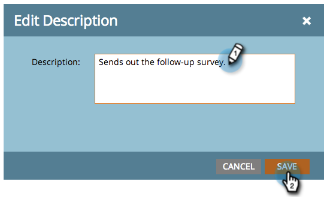

# Edición de entradas en la vista de programación del programa {#editing-entries-in-the-program-schedule-view}

Puede realizar modificaciones en los distintos elementos del programa en la vista de programación.

## Editar el nombre de una entrada {#edit-an-entrys-name}

1. Seleccione la entrada que desee editar.

   

1. Escriba un nombre nuevo y pulse **Intro/Retorno** en el teclado para confirmar el cambio.

   

>[!CAUTION]
>
>Esto solo cambia el nombre para mostrar en la vista de programación. El nombre del recurso en el programa seguirá siendo el mismo.

## Editar la descripción de una entrada {#edit-an-entrys-description}

1. Haga clic en el icono de descripción.

   

1. Edite la descripción. Haga clic en **Guardar**.

   

1. ¡Excelente! La descripción ha cambiado.

   

## Editar la fecha de una entrada {#edit-an-entrys-date}

1. Seleccione la nueva fecha.

   

¡Tú rocas! Ahora, la fecha de la entrada se ha movido a una nueva fecha.

>[!NOTE]
>
> Las entradas de campaña inteligente y de programa de correo electrónico que ya se hayan ejecutado no se pueden mover al pasado.
