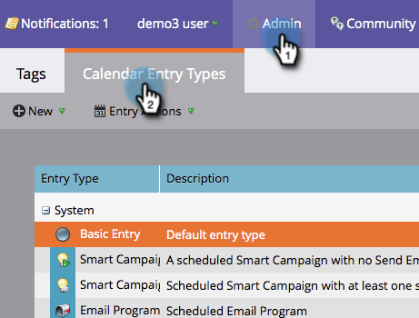

# Ocultar y mostrar tipos de entrada personalizados {#hiding-and-unhiding-custom-entry-types}

Los tipos de entradas personalizadas se pueden ocultar en la sección Administración. Una vez oculto, el tipo de entrada ya no se mostrará como opción.

## Ocultar un tipo de entrada personalizada {#hide-a-custom-entry-type}

1. Vaya a la sección **[!UICONTROL Admin]** y haga clic en **[!UICONTROL Tipos de entradas de calendario]**.

   

1. Haga clic con el botón secundario en la entrada personalizada y haga clic en **[!UICONTROL Ocultar]**.

   

   Este tipo de entrada ya no estará disponible para su uso.

## Mostrar un tipo de entrada personalizada {#unhide-a-custom-entry-type}

Para mostrar un tipo de entrada personalizada:

1. Haga clic con el botón derecho en la entrada y seleccione **[!UICONTROL Mostrar]**.

   

   El tipo de entrada personalizada ahora está visible.

   
