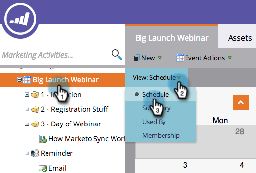
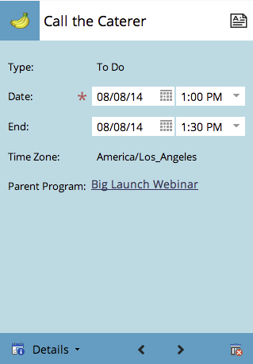
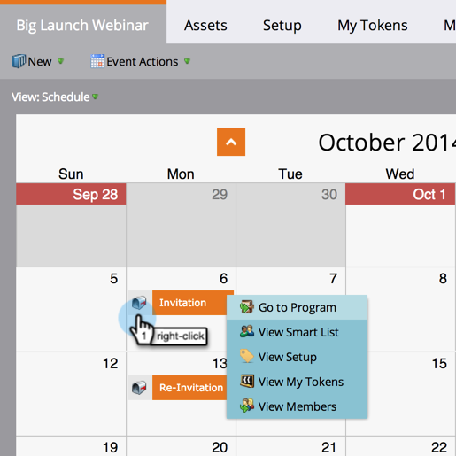
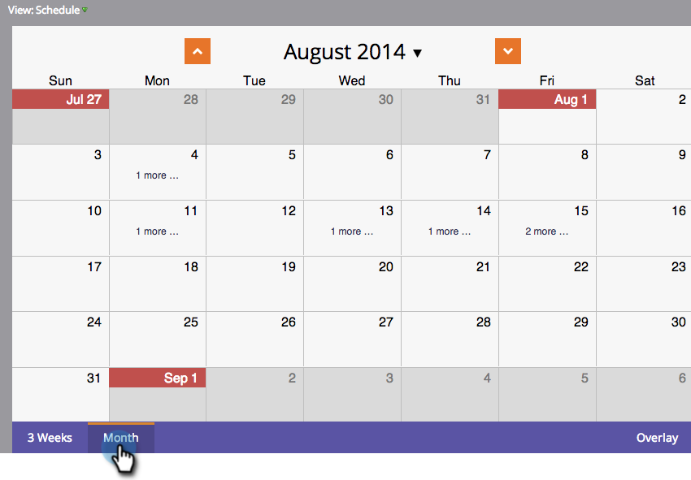

# Navegación por la vista Calendario del programa {#navigating-the-program-schedule-view}

Estos son los conceptos básicos para ayudarle a navegar por la vista de programación del programa.

## Búsqueda de la vista de programación {#find-the-schedule-view}

1. Vaya a **[!UICONTROL Actividades de marketing]**.

   

1. Seleccione el programa. Haga clic en la lista desplegable **[!UICONTROL Ver]**. Seleccione **[!UICONTROL Horario]**.

   

   Ahora aparece la vista de programación del programa.

   

>[!NOTE]
>
>La vista de programación del programa es fija. Una vez que lo establezca, todos los programas estarán predeterminados en la vista de programación.

## Cambio entre entradas {#switching-between-entries}

1. En los detalles de la entrada, haga clic en las flechas para ir a la siguiente entrada programada.

   

   

## Ver menú contextual {#view-context-menu}

1. Haga clic con el botón derecho en cualquier programa para realizar modificaciones en el programa, la lista inteligente, la configuración, mis tokens o los miembros.

   

## Cambio entre modos {#changing-between-modes}

1. Si hace clic en **[!UICONTROL 3 semanas]** o **[!UICONTROL Mes]**, se cambiarán las fechas visibles en la pantalla.

   

## Vista de pantalla completa {#full-screen-view}

1. Puede hacer clic en el icono de pantalla en la esquina superior derecha para ver la programación del programa en modo de pantalla completa.

   

>[!MORELIKETHIS]
>
>[Creando una entrada en la vista de programación del programa](/help/marketo/product-docs/core-marketo-concepts/programs/program-schedule-view/creating-an-entry-in-the-program-schedule-view.md){target="_blank"}
