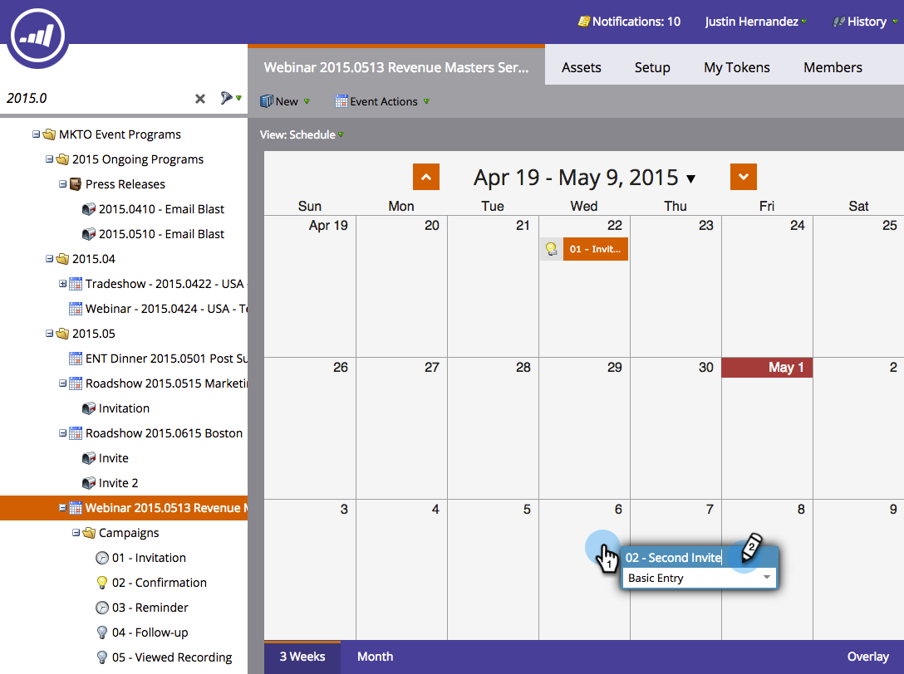

# Volver a ejecutar una campaña inteligente en la vista Calendario del programa {#rerun-a-smart-campaign-in-the-program-schedule-view}

Las nuevas ejecuciones de una campaña inteligente existente se pueden crear directamente desde la vista de programación del programa.

1. Vaya a **[!UICONTROL Actividades de marketing]**.

   

1. Seleccione un programa que contenga su campaña inteligente.

   

1. En la vista de programación, haga clic en el día para el que desee establecer la nueva ejecución y asigne a la entrada un nombre fácil de entender (por ejemplo, &quot;Segunda invitación&quot;).

   

1. Seleccione la lista desplegable del menú de tipo de entrada y elija la campaña inteligente que desea volver a ejecutar.

   

   >[!TIP]
   >
   >También puede hacerlo desde el [enfoque del programa](/help/marketo/product-docs/core-marketo-concepts/marketing-calendar/understanding-the-calendar/understand-enable-program-focus.md).

La campaña inteligente ahora está programada para otra ejecución. Si contiene los pasos para enviar correo electrónico, también aparecerán aquí.
