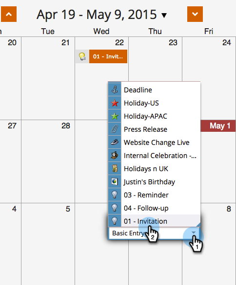

# Volver a ejecutar una Campaña inteligente en la Vista de Calandario del programa {#rerun-a-smart-campaign-in-the-program-schedule-view}

Puede crear fácilmente nuevas ejecuciones de una campaña inteligente existente directamente desde la vista de calandario del programa.

1. Vaya a **Actividades de marketing**.

   

1. Seleccione un programa que contenga la campaña inteligente.

   

1. En la vista de programación, haga clic en el día para el que desee configurar la nueva ejecución y asigne a la entrada un nombre que sea fácil de entender (por ejemplo, &quot;Segunda invitación&quot;).

   

1. Seleccione la lista desplegable del menú de tipo de entrada y elija la campaña inteligente que desee volver a ejecutar.

   

   >[!TIP]
   >
   >También puede hacerlo desde el [enfoque de programa](../../../../product-docs/core-marketo-concepts/marketing-calendar/understanding-the-calendar/understand-enable-program-focus.md).

¡Boom! Así de simple, has programado otra carrera para esa campaña inteligente. Si esa campaña inteligente contenía pasos para enviar correos electrónicos, ¡también los verá!