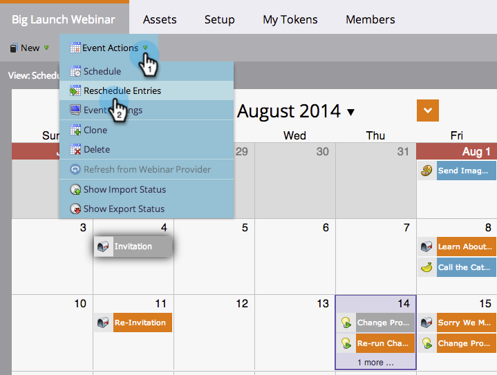

# Reprogramación de un programa completo desde la vista Calendario {#rescheduling-an-entire-program-from-the-schedule-view}

Al clonar un programa o evento con fechas, es probable que desee reprogramar todas las fechas a la vez. Así es cómo se hace.

1. Seleccione el programa que desea reprogramar.

   

1. Seleccione la lista desplegable Acción del evento. Elija **[!UICONTROL Reprogramar entradas]**.

   

1. Seleccionar una [!UICONTROL entrada de anclaje]. En función de este movimiento, todas las demás entradas se moverán con él.

   

1. Elija la [!UICONTROL nueva fecha de inicio].

   

1. Haga clic en **[!UICONTROL Reprogramar]**.

   

1. Nuestros recuperadores de datos desaprobarán, reprogramarán y volverán a aprobar todos sus recursos con las fechas correctas.

   

>[!NOTE]
>
>Los Assets que ya se hayan ejecutado no se moverán.

Ahora todo está reprogramado. Ajuste las fechas específicas según sea necesario.

