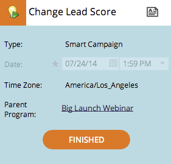

# Explicación de las fechas provisionales/confirmadas {#understanding-tentative-confirmed-dates}

Las campañas inteligentes y los programas de correo electrónico tienen una potente capacidad para marcarse como **[!UICONTROL Provisional]** o **[!UICONTROL Confirmado]**. Así es como funcionan.

## Tentativo {#tentative}

Las fechas provisionales transmiten la intención. Piense en esto como _escribir a lápiz_ algo en el calendario. Las entradas provisionales no se ejecutarán, solo son marcadores de posición.

>[!NOTE]
>
>Solo las campañas inteligentes por lotes y los programas de correo electrónico pueden ser provisionales.

## Confirmación de entradas {#confirming-entries}

Esto es igual que aprobar un recurso, por lo que las entradas deben configurarse completamente antes de poder confirmarlas. Una vez que todos tus patos estén en una fila, puedes confirmar las entradas deslizando la pestaña [!UICONTROL Tentative] a la derecha.

>[!NOTE]
>
>¿Por qué el perro? Él es un Recuperador. Está recuperando tus datos.

## Confirmado {#confirmed}

Las entradas confirmadas se ejecutarán sin duda. Tienen reglas, recursos aprobados y una fecha y hora confirmadas.

## Finalizado  {#finished}

Las entradas finalizadas ya se han ejecutado. Solo pueden estar en el pasado. Una vez que una entrada se ha ejecutado y está **[!UICONTROL Finalizada]**, no puede moverla ni convertirla en provisional.

Estos estados son herramientas poderosas. Al clonar un programa, todas las fechas de la campaña inteligente y del programa de correo electrónico serán provisionales. Todas se pueden confirmar directamente desde la vista de programación.
