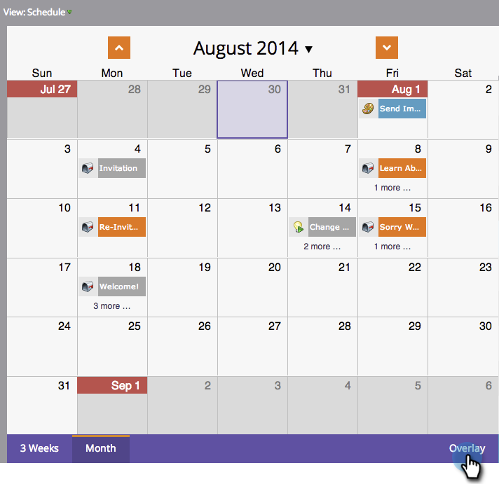
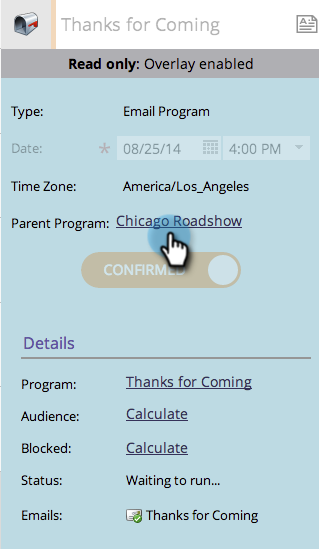

# Uso de una superposición global {#using-a-global-overlay}

La superposición global en la vista de programación del programa le permite ver el programa en relación con otros recursos programados.

>[!PREREQUISITES]
>
>Debe tener una [licencia del calendario de mercadotecnia](/help/marketo/product-docs/core-marketo-concepts/marketing-calendar/understanding-the-calendar/issue-revoke-a-marketing-calendar-license.md){target="_blank"} para utilizar esta característica.

## Uso de la superposición global {#use-the-global-overlay}

1. Seleccione el programa.

   

1. Seleccione **[!UICONTROL Superposición]** en la esquina inferior derecha.

   

1. Los bloques sólidos representan entradas en esa fecha. Haga clic para ver los detalles.

   

   Los detalles de entrada para los elementos de superposición serán de solo lectura. Haga clic en el programa principal para realizar cambios.

   

## Utilizar un filtro guardado como superposición {#use-a-saved-filter-as-an-overlay}

Si ha [guardado un filtro en el calendario de mercadotecnia](/help/marketo/product-docs/core-marketo-concepts/marketing-calendar/working-with-the-calendar/saving-a-filter-definition-in-the-marketing-calendar.md){target="_blank"}, puede utilizarlo como superposición en la vista de programación del programa.

1. Haga clic en el menú desplegable **[!UICONTROL Superposición]** y seleccione la definición del filtro.

   

   Ahora verá una superposición definida por el filtro que ha guardado y seleccionado.

   

   >[!MORELIKETHIS]
   >
   >[Creando superposiciones personalizadas en la vista de programación del programa](/help/marketo/product-docs/core-marketo-concepts/programs/program-schedule-view/creating-custom-overlays-in-program-schedule-view.md){target="_blank"}
