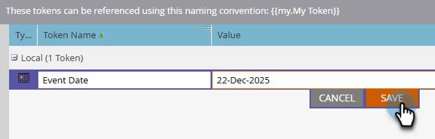

# Administrar mis tókenes {#managing-my-tokens}

El uso de tokens puede simplificar sus esfuerzos en Marketo Engage. Puede usar [Mis tokens](/help/marketo/product-docs/core-marketo-concepts/programs/tokens/understanding-my-tokens-in-a-program.md){target="_blank"} (tokens personalizados) en pasos de flujo, webhooks, correos electrónicos y páginas de aterrizaje. Así es como se hacen.

>[!TIP]
>
>Obtenga más información sobre los tokens que ya están disponibles en [Información general de tokens](/help/marketo/product-docs/demand-generation/landing-pages/personalizing-landing-pages/tokens-overview.md){target="_blank"}.

## Crear un token My local o global {#create-a-my-token}

>[!BEGINTABS]

>[!TAB Mis tokens locales]

1. En **[!UICONTROL Actividades de marketing]**, seleccione el programa o la carpeta de campaña que desee y haga clic en su ficha **[!UICONTROL Mis tokens]**.

   

1. Arrastre el My Token deseado al lienzo.

   

1. Escriba un nombre único e introduzca un valor relevante.

   

1. Haga clic en **[!UICONTROL Guardar]**.

   

>[!TAB Mis tokens globales]

>[!NOTE]
>
>Permisos de administración necesarios.

1. Vaya al área de **[!UICONTROL Admin]** y seleccione **[!UICONTROL Mis tokens]**.

   

1. Arrastre el My Token deseado al lienzo.

   

1. Escriba un nombre único e introduzca un valor relevante.

   

1. Haga clic en **[!UICONTROL Guardar]**.

   

>[!ENDTABS]

## Editar un token mío {#edit-a-my-token}

1. Seleccione el token que desee editar y haga clic en **[!UICONTROL Editar token]**.

   

1. Realice las ediciones que desee. Haga clic en **[!UICONTROL Guardar]** cuando termine.

   

## Eliminar un token mío {#delete-a-my-token}

>[!CAUTION]
>
>Al eliminar un My Token, asegúrese de que actualmente no se haga referencia a él en ningún recurso. Si se elimina, se mostrará un espacio en blanco en cualquier lugar donde se haga referencia a él.

1. Seleccione el token que desee eliminar y haga clic en **[!UICONTROL Eliminar token]**.

   

1. Haga clic en **[!UICONTROL Eliminar]**.

   

   >[!MORELIKETHIS]
   >
   >* [Información general de tokens](/help/marketo/product-docs/demand-generation/landing-pages/personalizing-landing-pages/tokens-overview.md){target="_blank"}
   >* [Explicación de mis tokens en un programa](/help/marketo/product-docs/core-marketo-concepts/programs/tokens/understanding-my-tokens-in-a-program.md){target="_blank"}
   >* [Usando direcciones URL en Mis tokens](/help/marketo/product-docs/email-marketing/general/using-tokens/using-urls-in-my-tokens.md){target="_blank"}
